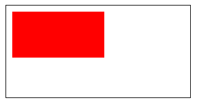

# canvasContext.setFillStyle

### 定义
设置填充色。

**Tip**: 如果没有设置 `fillStyle`，默认颜色为 `black`。

### 语法
```javascript
canvasContext.setFillStyle(color)
canvasContext.fillStyle = color // 基础库 1.9.90 起支持
```

### 参数

| 参数    | 类型                        | 定义   |
| ----- | ------------------------- | ---- |
| color | [Color](./color.md) | Gradient Object | 填充色  |

### 例子

```js
const ctx = wx.createCanvasContext('myCanvas')
ctx.setFillStyle('red')
ctx.fillRect(10, 10, 150, 75)
ctx.draw()
```


