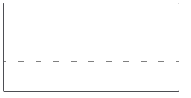

# canvasContext.setLineDash


### 定义
设置虚线样式的方法。


### 参数
| 参数        | 类型     | 说明           |
| --------- 	| ------ 		| ------------ |
| pattern 		| Array 		| 一组描述交替绘制线段和间距（坐标空间单位）长度的数字 |
| offset	 		| Number 	| 虚线偏移量 |


### 例子

```js
const ctx = wx.createCanvasContext('myCanvas')

ctx.setLineDash([10, 20], 5);

ctx.beginPath();
ctx.moveTo(0,100);
ctx.lineTo(400, 100);
ctx.stroke();

ctx.draw()
```


