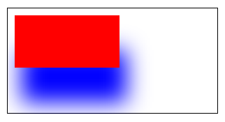

# canvasContext.setShadow

### 定义
设置阴影样式。

**Tip**: 如果没有设置，offsetX 默认值为0， offsetY 默认值为0， blur 默认值为0，color 默认值为 `black`。

### 参数

| 参数    | 类型   | 范围  | 定义                           |
|---------|--------|-------|--------------------------------|
| offsetX | Number |       | 阴影相对于形状在水平方向的偏移 |
| offsetY | Number |       | 阴影相对于形状在竖直方向的偏移 |
| blur    | Number | 0~100 | 阴影的模糊级别，数值越大越模糊 |
| color   | [Color](./color.md)  |       | 阴影的颜色                     |

### 例子

```js
const ctx = wx.createCanvasContext('myCanvas')
ctx.setFillStyle('red')
ctx.setShadow(10, 50, 50, 'blue')
ctx.fillRect(10, 10, 150, 75)
ctx.draw()
```




# canvasContext.shadowBlur


### 定义
设置阴影的模糊级别

### 语法
```javascript
canvasContext.shadowBlur = value
```


# canvasContext.shadowColor


### 定义
设置阴影的颜色

### 语法
```javascript
canvasContext.shadowColor = value
```


# canvasContext.shadowOffsetX


### 定义
设置阴影相对于形状在水平方向的偏移

### 语法
```javascript
canvasContext.shadowOffsetX = value
```


# canvasContext.shadowOffsetY


### 定义
设置阴影相对于形状在竖直方向的偏移

### 语法
```javascript
canvasContext.shadowOffsetY = value
```
