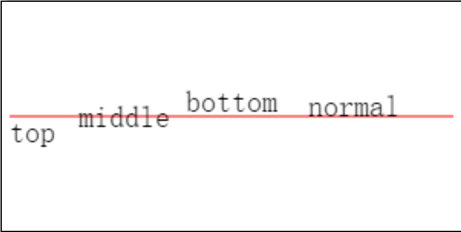

# canvasContext.setTextBaseline


### 定义
用于设置文字的水平对齐

### 语法
```javascript
canvasContext.setTextBaseline(textBaseline)
canvasContext.textBaseline = textBaseline // 基础库 1.9.90 起支持
```

### 参数

| 参数  | 类型                      | 定义                             |
| ----- | ------------------------- | ----                             |
| textBaseline | String                    | 可选值 'top'、'bottom'、'middle'、'normal' |

### 示例代码：

```js
const ctx = wx.createCanvasContext('myCanvas')

ctx.setStrokeStyle('red')
ctx.moveTo(5, 75)
ctx.lineTo(295, 75)
ctx.stroke()

ctx.setFontSize(20)

ctx.setTextBaseline('top')
ctx.fillText('top', 5, 75)

ctx.setTextBaseline('middle')
ctx.fillText('middle', 50, 75)

ctx.setTextBaseline('bottom')
ctx.fillText('bottom', 120, 75)

ctx.setTextBaseline('normal')
ctx.fillText('normal', 200, 75)

ctx.draw()
```


