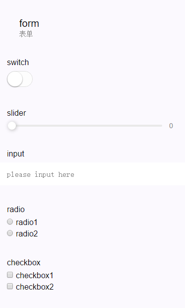

#### form

表单，将组件内的用户输入的`<switch/>` `<input/>` `<checkbox/>` `<slider/>` `<radio/>` `<picker/>` 提交。

当点击 `<form/>` 表单中 formType 为 submit 的 `<button/>` 组件时，会将表单组件中的 value 值进行提交，需要在表单组件中加上 name 来作为 key。


| 属性名             | 类型         | 说明                                                                                    |  最低版本            |
| -------------     | ----------- | ----------------------------------------                                                | ----------           |
| report-submit     | Boolean     | 是否返回 formId 用于发送[模板消息](../api/notice.md)                                        |                      |
| bindsubmit        | EventHandle | 携带 form 中的数据触发 submit 事件，event.detail = {value : {'name': 'value'} , formId: ''} |                      |
| bindreset         | EventHandle | 表单重置时会触发 reset 事件                                                                 |                      |
<!--
| bindautofill      | EventHandle | 表单项有被快速填充时触发                                                                     |  |
| bindautofillerror | EventHandle | 快速填写出错时触发                                                                          |  |


#### <a name="autofill"></a>快速填写表单
快速填充表单是在表单提交时记住用户在input、textarea、picker组件填写的内容，下次填写时可进行快速填充。需要给input、textarea、picker指定auto-fill字段，字段定义如下：

| 分组                  | 字段名 | 字段定义 | 说明 |
| ----                 | ----   | ----     | ---- |
| 公共字段              | name<br>id_card_num<br>phone | 姓名<br>身份证号<br>手机号 | 可以与任意分组组合 |
| base_info            | email<br>sex<br>birthday<br>nationality<br>ethnic_group | 邮箱<br>性别<br>生日<br>国籍<br>民族 | 基础信息 |
| driving_licence_info | licence_num<br>licence_file_num<br>licence_plate_num<br>engine_num<br>licence_hassis_num | 驾驶证号<br>驾驶证档案编号<br>行驶证车牌号<br>行驶证发动机号<br>行驶证车架号 | 车辆信息 |
| address_info         | nationality<br>address<br>address_detail<br>postcode | 国家<br>省<br>详细地址<br>邮编 | 收货地址 |
| passport             | passport_num<br>validity<br>issue_at<br>first_name_zh<br>last_name_zh<br>first_name_en<br>last_name_en<br>birth_place<br>residence_place | 护照号<br>护照有效期<br>签发地<br>名字（中文）<br>姓氏（中文）<br>名字（英文）<br>姓氏（英文）<br>户口出生地<br>户口所在地 | 护照 |
| hk_macau_passport    | passport_num<br>validity<br>issue_at<br>first_name_zh<br>last_name_zh<br>first_name_en<br>last_name_en<br>birth_place<br>residence_place | 港澳通行证号<br>通行证有效期<br>签发地<br>名字（中文）<br>姓氏（中文）<br>名字（英文）<br>姓氏（英文）<br>户口出生地<br>户口所在地 | 护照 |
| social_security      | card_num | 社保卡号 | 社保 |
-->

**示例代码：**



```html
<form bindsubmit="formSubmit" bindreset="formReset">
  <view class="section section_gap">
    <view class="section__title">switch</view>
    <switch name="switch"/>
  </view>
  <view class="section section_gap">
    <view class="section__title">slider</view>
    <slider name="slider" show-value ></slider>
  </view>

  <view class="section">
    <view class="section__title">input</view>
    <input name="input" placeholder="please input here" />
  </view>
  <view class="section section_gap">
    <view class="section__title">radio</view>
    <radio-group name="radio-group">
      <label><radio value="radio1"/>radio1</label>
      <label><radio value="radio2"/>radio2</label>
    </radio-group>
  </view>
  <view class="section section_gap">
    <view class="section__title">checkbox</view>
    <checkbox-group name="checkbox">
      <label><checkbox value="checkbox1"/>checkbox1</label>
      <label><checkbox value="checkbox2"/>checkbox2</label>
    </checkbox-group>
  </view>
  <view class="btn-area">
    <button formType="submit">Submit</button>
    <button formType="reset">Reset</button>
  </view>
</form>
```

```js
Page({
  formSubmit: function(e) {
    console.log('form发生了submit事件，携带数据为：', e.detail.value)
  },
  formReset: function() {
    console.log('form发生了reset事件')
  }
})
```

