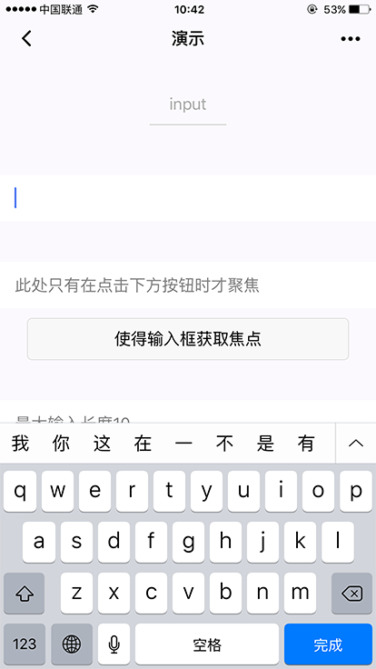

#### input

输入框。

| 属性名            | 类型        | 默认值              | 说明                                                                                                                 | 最低版本     |
| ----------------- | ----------- | -----------------   | ----------------------------------------                                                                             | --------     |
| value             | String      |                     | 输入框的初始内容                                                                                                     |              |
| type              | String      | "text"              | input 的类型                                                                                                         |              |
| password          | Boolean     | false               | 是否是密码类型                                                                                                       |              |
| placeholder       | String      |                     | 输入框为空时占位符                                                                                                   |              |
| placeholder-style | String      |                     | 指定 placeholder 的样式                                                                                              |              |
| placeholder-class | String      | "input-placeholder" | 指定 placeholder 的样式类                                                                                            |              |
| disabled          | Boolean     | false               | 是否禁用                                                                                                             |              |
| maxlength         | Number      | 140                 | 最大输入长度，设置为 -1 的时候不限制最大长度                                                                         |              |
| cursor-spacing    | Number      | 0                   | 指定光标与键盘的距离，单位 px 。取 input 距离底部的距离和 cursor-spacing 指定的距离的最小值作为光标与键盘的距离      |              |
| auto-focus        | Boolean     | false               | (即将废弃，请直接使用 focus )自动聚焦，拉起键盘                                                                      |              |
| focus             | Boolean     | false               | 获取焦点                                                                                                             |              |
| confirm-type      | String      | "done"              | 设置键盘右下角按钮的文字，仅在type='text'时生效                                                                |  |
| confirm-hold      | Boolean     | false               | 点击键盘右下角按钮时是否保持键盘不收起                                                                               |  |
| cursor            | Number      |                     | 指定focus时的光标位置                                                                                                |  |   
| selection-start   | Number      | -1                  | 光标起始位置，自动聚集时有效，需与selection-end搭配使用                                                              |  |
| selection-end     | Number      | -1                  | 光标结束位置，自动聚集时有效，需与selection-start搭配使用                                                            |  |
| adjust-position   | Boolean     | true                | 键盘弹起时，是否自动上推页面                                                                                         |  |
| bindinput         | EventHandle |                     | 键盘输入时触发，event.detail = {value, cursor, keyCode}，keyCode 为键值，2.1.0 起支持，处理函数可以直接 return 一个字符串，将替换输入框的内容。    |              |
| bindfocus         | EventHandle |                     | 输入框聚焦时触发，event.detail = { value, height }，height 为键盘高度，在基础库 1.9.90 起支持                        |              |
| bindblur          | EventHandle |                     | 输入框失去焦点时触发，event.detail = {value: value}                                                                  |              |
| bindconfirm       | EventHandle |                     | 点击完成按钮时触发，event.detail = {value: value}                                                                    |              |
<!--
| auto-fill         | String      |                     | 快速填写表单字段，字段请看[定义](./form.md#autofill)                        |  |
-->

**type 有效值：**

| 值     | 说明               |
| ------ | ------------------ |
| text   | 文本输入键盘       |
| number | 数字输入键盘       |
| idcard | 身份证输入键盘     |
| digit  | 带小数点的数字键盘 |

**confirm-type 有效值：**

| 值     | 说明                 |
| ------ | -------------------- |
| send   | 右下角按钮为“发送”   |
| search | 右下角按钮为“搜索”   |
| next   | 右下角按钮为“下一个” |
| go     | 右下角按钮为“前往”   |
| done   | 右下角按钮为“完成”   |

- 注：confirm-type的最终表现与手机输入法本身的实现有关，部分安卓系统输入法和第三方输入法可能不支持或不完全支持。

**示例代码：**



```html
<!--input.wxml-->
<view class="section">
  <input placeholder="这是一个可以自动聚焦的input" auto-focus/>
</view>
<view class="section">
  <input placeholder="这个只有在按钮点击的时候才聚焦" focus="{{focus}}" />
  <view class="btn-area">
    <button bindtap="bindButtonTap">使得输入框获取焦点</button>
  </view>
</view>
<view class="section">
  <input  maxlength="10" placeholder="最大输入长度10" />
</view>
<view class="section">
  <view class="section__title">你输入的是：{{inputValue}}</view>
  <input  bindinput="bindKeyInput" placeholder="输入同步到view中"/>
</view>
<view class="section">
  <input  bindinput="bindReplaceInput" placeholder="连续的两个1会变成2" />
</view>
<view class="section">
  <input password type="number" />
</view>
<view class="section">
  <input password type="text" />
</view>
<view class="section">
  <input type="digit" placeholder="带小数点的数字键盘"/>
</view>
<view class="section">
  <input type="idcard" placeholder="身份证输入键盘" />
</view>
<view class="section">
  <input placeholder-style="color:red" placeholder="占位符字体是红色的" />
</view>
```

```javascript
//input.js
Page({
  data: {
    focus: false,
    inputValue: ''
  },
  bindButtonTap: function() {
    this.setData({
      focus: true
    })
  },
  bindKeyInput: function(e) {
    this.setData({
      inputValue: e.detail.value
    })
  },
  bindReplaceInput: function(e) {
    var value = e.detail.value
    var pos = e.detail.cursor
    if(pos != -1){
      //光标在中间
      var left = e.detail.value.slice(0,pos)
      //计算光标的位置
      pos = left.replace(/11/g,'2').length
    }

    //直接返回对象，可以对输入进行过滤处理，同时可以控制光标的位置
    return {
      value: value.replace(/11/g,'2'),
      cursor: pos
    }

    //或者直接返回字符串,光标在最后边
    //return value.replace(/11/g,'2'),
  }
})
```


#### Bug & Tip

1. `bug` : 微信版本 `6.3.30`, focus 属性设置无效；
1. `bug` : 微信版本 `6.3.30`, placeholder 在聚焦时出现重影问题；
1. `tip` : input 组件是一个 native 组件，字体是系统字体，所以无法设置 font-family；
1. `tip` : 在 input 聚焦期间，避免使用 css 动画；
1. `tip` : 对于将 `input` 封装在自定义组件中、而 `from` 在自定义组件外的情况， `form` 将不能获得这个自定义组件中 `input` 的值。此时需要使用自定义组件的 [内置 behaviors](../framework/custom-component/behaviors.md) `wx://form-field`。
