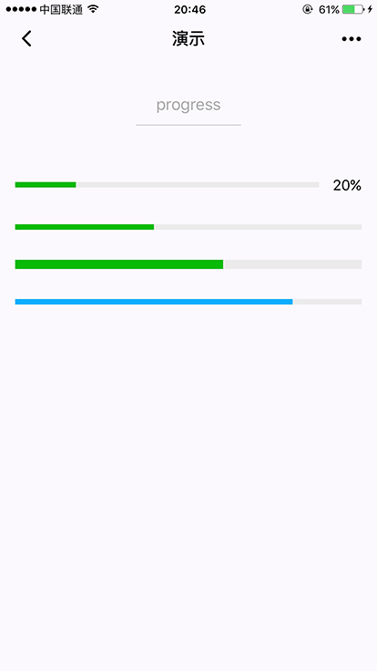

#### progress

进度条。

| 属性名          | 类型      | 默认值    | 说明           | 最低版本 |
| --------------- | --------- | --------- | -------------- | -------- |
| percent         | Float     | 无        | 百分比0~100    |          |
| show-info       | Boolean   | false     | 在进度条右侧显示百分比  | |
| stroke-width    | Number    | 6         | 进度条线的宽度，单位px  | |
| color           | Color     | #09BB07   | 进度条颜色 （请使用 activeColor）| |
| activeColor     | Color     |           | 已选择的进度条的颜色 |    |
| backgroundColor | Color     |           | 未选择的进度条的颜色 |    |
| active          | Boolean   | false     | 进度条从左往右的动画 |    |
| active-mode     | String    | backwards | backwards: 动画从头播；forwards：动画从上次结束点接着播 |  |


**示例：**



```html
<progress percent="20" show-info />
<progress percent="40" stroke-width="12" />
<progress percent="60" color="pink" />
<progress percent="80" active />
```


