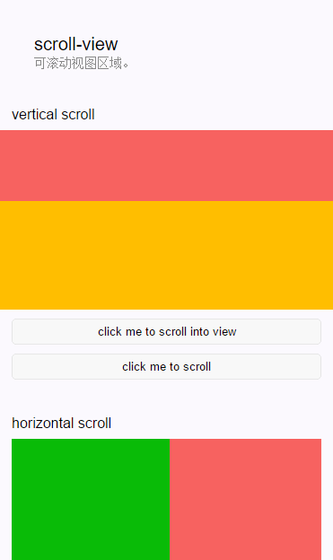

#### scroll-view

可滚动视图区域。

| 属性名               | 类型          | 默认值   | 说明                                       |
| ----------------- | ----------- | ----- | ---------------------------------------- |
| scroll-x          | Boolean     | false | 允许横向滚动                                   |
| scroll-y          | Boolean     | false | 允许纵向滚动                                   |
| upper-threshold   | Number      | 50    | 距顶部/左边多远时（单位px），触发 scrolltoupper 事件        |
| lower-threshold   | Number      | 50    | 距底部/右边多远时（单位px），触发 scrolltolower 事件        |
| scroll-top        | Number      |       | 设置竖向滚动条位置                                |
| scroll-left       | Number      |       | 设置横向滚动条位置                                |
| scroll-into-view  | String      |       | 值应为某子元素id（id不能以数字开头）。设置哪个方向可滚动，则在哪个方向滚动到该元素           |
| scroll-with-animation | Boolean | false | 在设置滚动条位置时使用动画过渡 |
| enable-back-to-top    | Boolean | false | iOS点击顶部状态栏、安卓双击标题栏时，滚动条返回顶部，只支持竖向 |
| bindscrolltoupper | EventHandle |       | 滚动到顶部/左边，会触发 scrolltoupper 事件              |
| bindscrolltolower | EventHandle |       | 滚动到底部/右边，会触发 scrolltolower 事件              |
| bindscroll        | EventHandle |       | 滚动时触发，event.detail = {scrollLeft, scrollTop, scrollHeight, scrollWidth, deltaX, deltaY} |

使用竖向滚动时，需要给`<scroll-view/>`一个固定高度，通过 WXSS 设置 height。

**示例代码：**

```html
<view class="section">
  <view class="section__title">vertical scroll</view>
  <scroll-view scroll-y style="height: 200px;" bindscrolltoupper="upper" bindscrolltolower="lower" bindscroll="scroll" scroll-into-view="{{toView}}" scroll-top="{{scrollTop}}">
    <view id="green" class="scroll-view-item bc_green"></view>
    <view id="red"  class="scroll-view-item bc_red"></view>
    <view id="yellow" class="scroll-view-item bc_yellow"></view>
    <view id="blue" class="scroll-view-item bc_blue"></view>
  </scroll-view>

  <view class="btn-area">
    <button size="mini" bindtap="tap">click me to scroll into view </button>
    <button size="mini" bindtap="tapMove">click me to scroll</button>
  </view>
</view>
<view class="section section_gap">
  <view class="section__title">horizontal scroll</view>
  <scroll-view class="scroll-view_H" scroll-x style="width: 100%">
    <view id="green" class="scroll-view-item_H bc_green"></view>
    <view id="red"  class="scroll-view-item_H bc_red"></view>
    <view id="yellow" class="scroll-view-item_H bc_yellow"></view>
    <view id="blue" class="scroll-view-item_H bc_blue"></view>
  </scroll-view>
</view>
```

```js
var order = ['red', 'yellow', 'blue', 'green', 'red']
Page({
  data: {
    toView: 'red',
    scrollTop: 100
  },
  upper: function(e) {
    console.log(e)
  },
  lower: function(e) {
    console.log(e)
  },
  scroll: function(e) {
    console.log(e)
  },
  tap: function(e) {
    for (var i = 0; i < order.length; ++i) {
      if (order[i] === this.data.toView) {
        this.setData({
          toView: order[i + 1]
        })
        break
      }
    }
  },
  tapMove: function(e) {
    this.setData({
      scrollTop: this.data.scrollTop + 10
    })
  }
})

```



##### Bug & Tip

1. `tip`: 请勿在 `scroll-view` 中使用 `textarea`、`map`、`canvas`、`video` 组件
1. `tip`: `scroll-into-view` 的优先级高于 `scroll-top`
1. `tip`: 在滚动 `scroll-view` 时会阻止页面回弹，所以在 `scroll-view` 中滚动，是无法触发 `onPullDownRefresh`
1. `tip`: 若要使用下拉刷新，请使用页面的滚动，而不是 `scroll-view` ，这样也能通过点击顶部状态栏回到页面顶部
