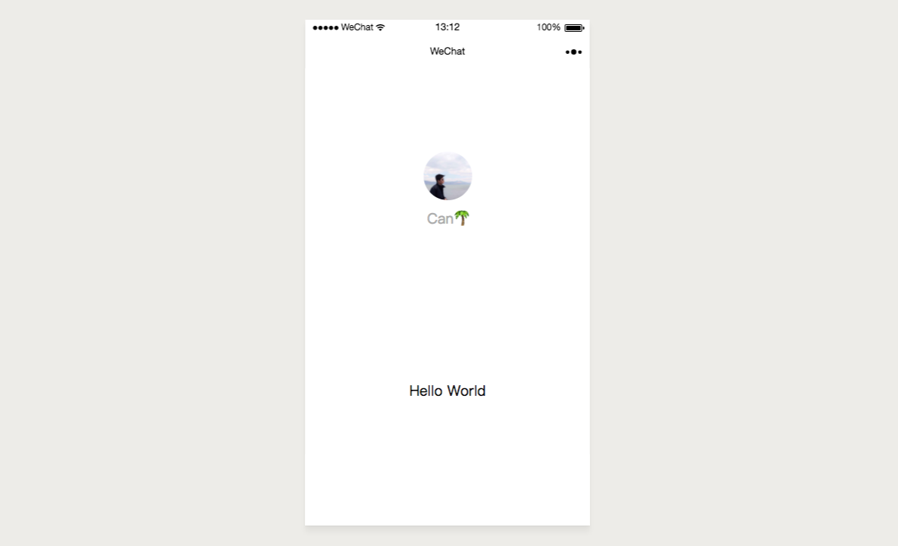
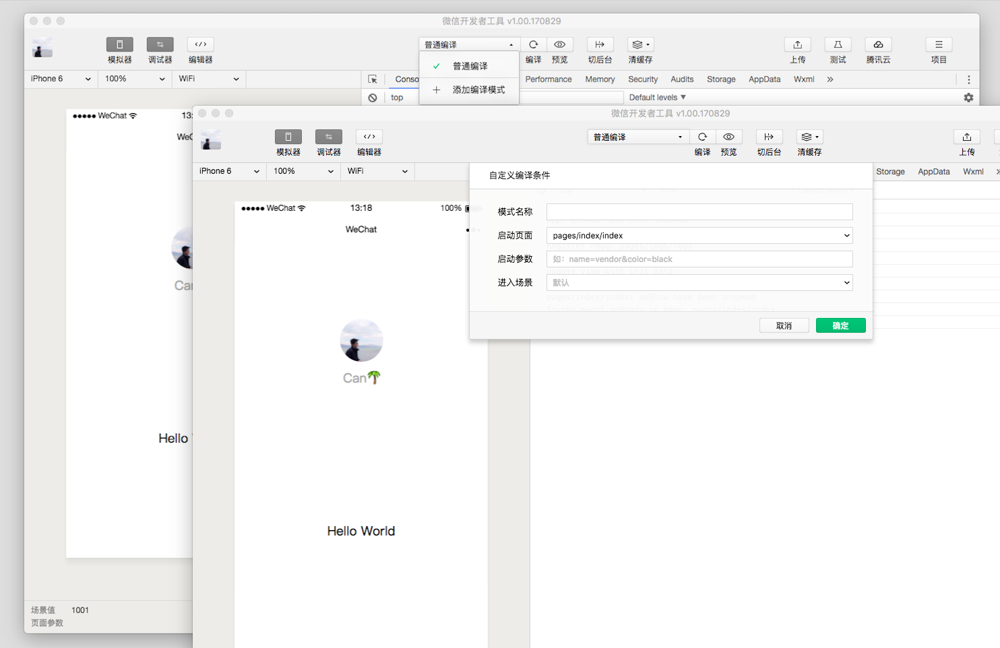
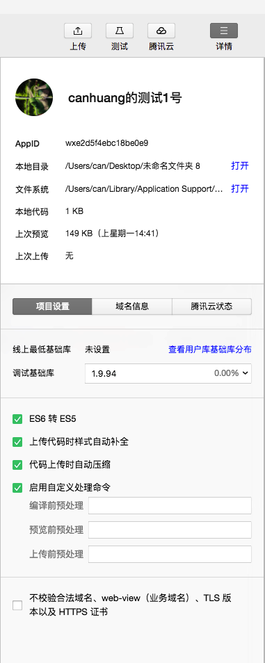
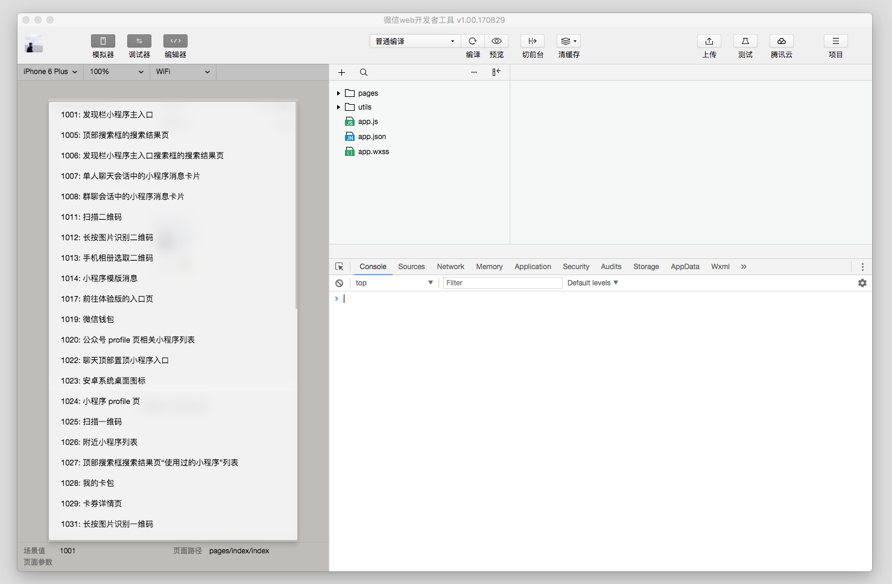
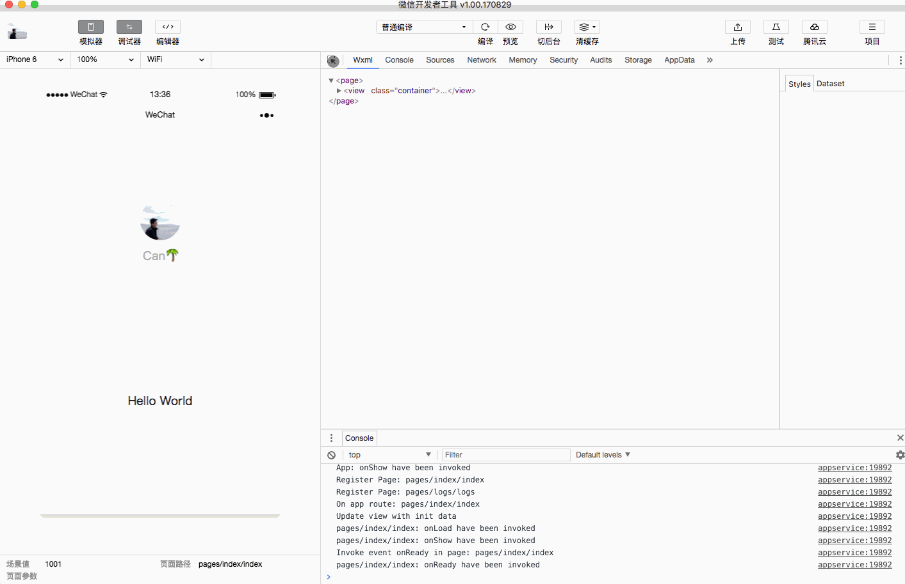
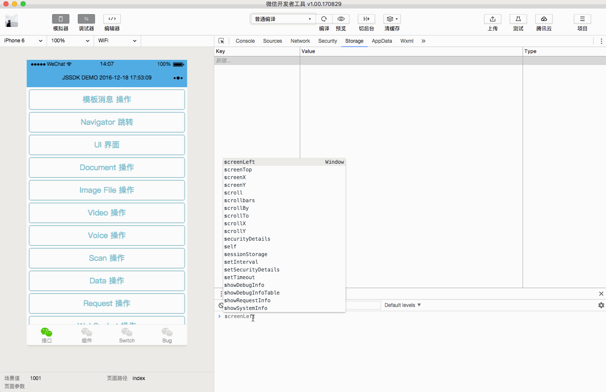
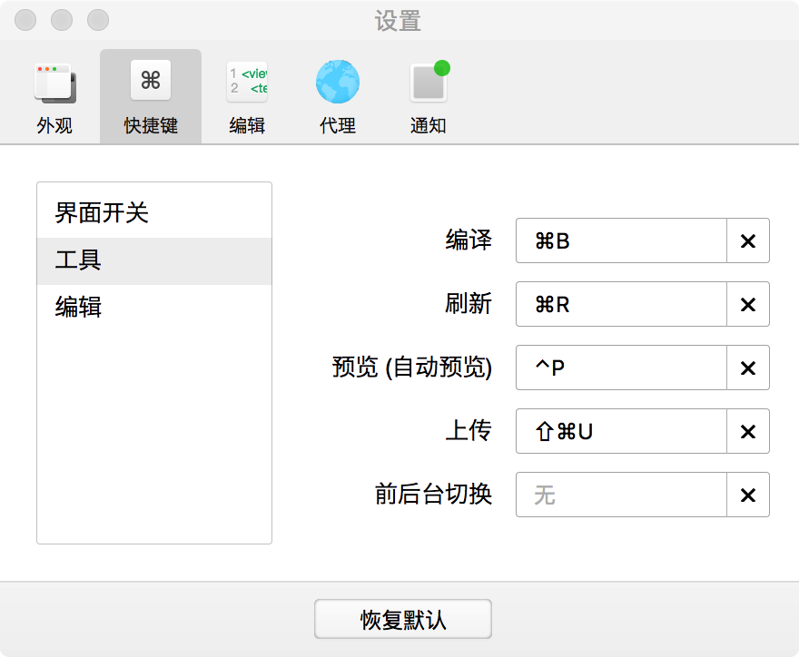

程序调试主要有三大功能区：模拟器、调试工具和小程序操作区

## 模拟器

模拟器模拟微信小程序在客户端真实的逻辑表现，对于绝大部分的 API 均能够在模拟器上呈现出正确的状态。

## 自定义编译

点击工具栏中的编译按钮或者使用快捷键 Ctrl(⌘) + B，可以编译当前代码，并自动刷新模拟器。

同时为了帮助开发者调试从不同场景值进入具体的页面，开发者可以添加或选择已有的自定义编译条件进行编译和代码预览（如图）。

**注：编译条件跟项目相关，每个项目可以保存自己相关的编译条件**

### 编译异常信息

在预览或上传的过程中，可能会出现编译异常信息。

忽略上传的文件：在项目文件夹下，某些文件可能不是小程序运行所需的，例如 readme 文档、`.gitignore` 文件等。为了优化大小，在预览和上传的过程中，这些文件将不会被打包。

体积过大的文件：如果勾选了 ES6 转 ES5 或代码压缩的选项，为了优化编译速度，对于某些体积很大的 JS 文件，工具会跳过对这些文件的处理。

## 自定义预处理

在项目设置页卡，我们提供了以下几个默认的预处理，可以解决大部分的代码文件预处理的问题

1. ES6 转 ES5（可以应用于编译、预览、上传），使用 "babel-core": "^6.26.0"
1. 上传代码时样式自动补全，使用 "postcss": "^6.0.1"
1. 上传代码时自动压缩，使用 "uglify-js": "3.0.27"

对于高级开发者来说，完全可以自己编写自动化构建脚本对代码文件进行预处理，所以我们提供了 `启用自定义处理命令` 选项
开发者可以指定 `编译前/预览前/上传前` 需要预处理的命令
开发者工具使用 shell 的方式运行指定的命令，并在控制台中输出命令的执行日志

预处理命令的执行顺序

1. 自定义预处理命令
1. 默认预处理命令
1. 编译/预览/上传

注：

1. 编译前预处理命令，需要手动点击 "编译" 按钮，或者使用快捷键编译才能触发。文件修改无法触发该命令。
2. Mac 版本的开发者工具无法复用 bash 中的 Path 环境变量。可能需要手动设置系统的 Path 环境变量，才能正常执行命令。

## 前后台切换

工具栏中前后台切换帮助开发者模拟一些客户端的环境操作。例如当用户从小程序中回到聊天窗口，会触发一个小程序被设置为后台的回调。

## 调试工具

调试工具分为 7 大功能模块：Wxml、Console、Sources、Network、Appdata、Storage、Sensor、Trace

### Wxml panel

Wxml panel 用于帮助开发者开发 wxml 转化后的界面。在这里可以看到真实的页面结构以及结构对应的 wxss 属性，同时可以通过修改对应 wxss 属性，在模拟器中实时看到修改的情况（仅为实时预览，无法保存到文件）。通过调试模块左上角的选择器，还可以快速定位页面中组件对应的 wxml 代码。

### Sources panel

Sources panel 用于显示当前项目的脚本文件，同浏览器开发不同，微信小程序框架会对脚本文件进行编译的工作，所以在 Sources panel 中开发者看到的文件是经过处理之后的脚本文件，开发者的代码都会被包裹在 define 函数中，并且对于 Page 代码，在尾部会有 require 的主动调用。

**注：当代码运行到断点的时候，整个小程序都停止了，所以模拟器会出现白屏或者无法操作的情况**

### AppData panel

AppData panel 用于显示当前项目运行时小程序 AppData 具体数据，实时地反映项目数据情况，可以在此处编辑数据，并及时地反馈到界面上。

### Storage panel

Storage panel 用于显示当前项目使用 `wx.setStorage` 或者 `wx.setStorageSync` 后的数据存储情况。

可以直接在 Storage panel 上对数据进行删除（按 delete 键）、新增、修改

### Network panel

Network Panel 用于观察和显示 request 和 socket 的请求情况

**注：uploadFile 和 downloadFile 暂时不支持在 Network Panel 中查看**

### Console panel

Console panel 有两大功能：

- 开发者可以在此输入和调试代码

  

- 小程序的错误输出，会显示在此处

  

- 在控制台中可以输入以下命令

> build: 编译小程序
>
> preview: 预览
>
> upload: 上传代码
>
> openVendor: 打开基础库所在目录
>
> openToolsLog: 打开工具日志目录
>
> checkProxy(url): 检查指定 url 的代理使用情况

### Sensor panel

Sensor panel 有两大功能：

- 开发者可以在这里选择模拟地理位置

  

- 开发可以在这里模拟移动设备表现，用于调试重力感应 API

  

## 自定义数据上报

开发者工具上可以编辑和调试[自定义分析](https://mp.weixin.qq.com/debug/wxadoc/analysis/custom/)的数据上报功能，点击菜单栏中的 “工具 - 自定义分析” 即可弹窗打开自定义分析：

  

在页面中可以新建、查看或修改事件，在修改事件的页面中编辑完毕后，点击底部的保存并测试按钮将保存当前配置，同时工具将在调试器上提示收到最新配置，并展示配置信息，展示的内容包括事件的 ID 和名称，以及每个动作的触发条件和上报数据：

  
  

接着可以在模拟器中操作和触发事件。在模拟器中刷新小程序也将获取该测试配置，除非窗口被关闭。窗口关闭后模拟器不会再收到配置。当事件被触发上报时，工具上会展示上报信息，包括事件 ID、触发页面、触发方式、触发时动作、以及上报的字段值和数据：

  

同时可以在窗口中点击 “同步结果” 会同步显示上报的数据：
  

关闭窗口后，配置将全部失效，模拟器不再收到配置并不再触发上报（小程序中使用 `wx.reportAnalytics` API 进行的数据上报仍会在工具中输出）。
测试成功后，可到小程序后台发布事件配置，即可正式生效收集所定义的事件数据。

## 自动预览

自动预览可以实现编写小程序时快速预览，免去了每次查看小程序效果时都要扫码或者使用小程序开发助手的麻烦。只需按下快捷键，保持前台运行的微信即可自动唤出或刷新小程序。

要使用自动预览功能，需要配合 6.6.7 及以上的微信客户端版本。

  

要开始使用 “自动预览” 功能，可以在打开预览二维码的时候，点击 “自动预览” 标签以切换到自动预览模式。切换到自动预览模式后，只需按下预览快捷键，或者点击浮窗上的 “编译并预览” 按钮，即可触发自动预览。此时工具会上传代码，保持前台运行的微信客户端会自动刷新当前开发的小程序。

当自动预览成功时，工具栏上的预览图标会显示为一个绿勾。如果预览出错，则会显示为一个红色惊叹号，可以点击查看详情。

注意，自动预览功能仅限与登陆开发者工具的同账号微信使用。如需换回普通预览模式，只需要点击 “扫描二维码预览” 标签即可。

用户可以在快捷键设置里自定义预览快捷键。

  
