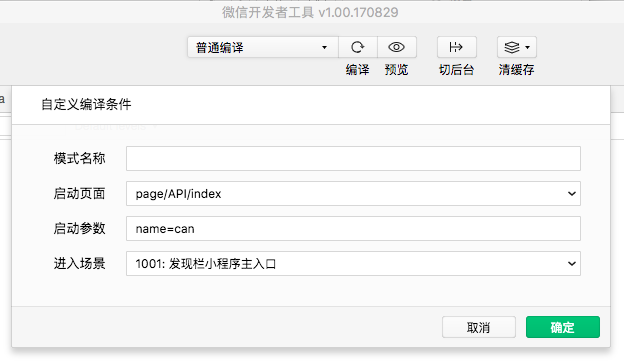
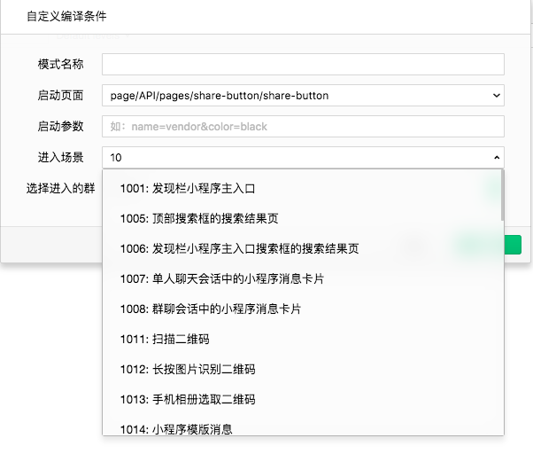
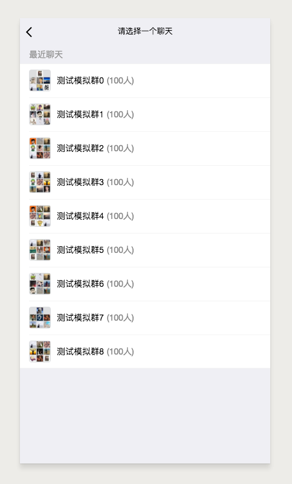
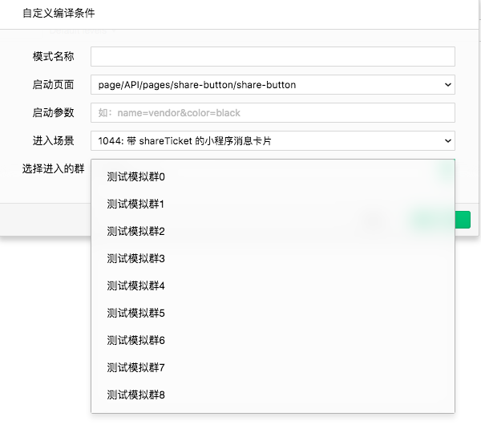
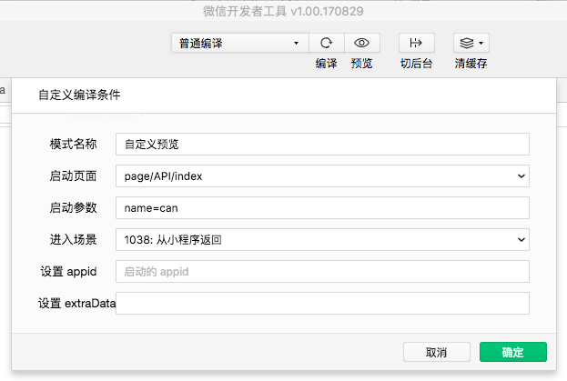

小程序开发者工具是对微信客户端的模拟，受限于桌面设备同移动设备的差异，以及微信的一些特有数据，同时考虑到开发的便捷性，部分 API 在工具和微信中有所不同。

## 扫码接口

同手机端直接调用摄像头来扫码不同，在 PC 或者 Mac 上调用摄像头来扫码完成调试是一个低效的行为，所以在开发工具上调用二维码扫码 API 后，开发者可以选择一个本地的图片来进行后续的逻辑调试，而不是真正的启用摄像头来扫码，流程有所不同，但是接口的输入和输出是一致的。

## 微信支付

最新版本的开发者工具已经支持微信支付的调试，但是为了兼顾到安全，同手机上直接调用微信支付有所不同：

- 新绑定的开发者需要 24 小时后才有权限进行微信支付的调试
- 开发者在工具上调用微信支付的 API 后，开发工具会出现一个二维码，开发者必须使用当前开发所使用的微信号扫码后在手机上完成支付的流程
- 工具会同步移动端微信支付的回包到工具中，开发者自行进行后续的操作

使用的交互有所不同，但是接口的输入输出工具同客户端是保持一致的。

## 启动使用自定义参数

在日常使用中，用户可以通过扫码、分享打开一个小程序，这时候会依据设置的启动页面：`path` 跳转到对应的小程序页面（不一定是首页）并且可以携带参数：`query`。在开发者工具中，开发者同样可以通过自定义编译条件的方式来达到调试不同启动页面和启动参数的目的。

例如下图是选择进入页面是 `page/API/index`，参数 是 `name=can`

## 进入场景值

在微信客户端中，用户可能在各个场景下打开小程序 [详情](../framework/app-service/scene.md#场景值) ，然而在开发者工具中是没有真实的环境去模拟这些场景的。开发者可以通过条件编译的方式来达到调试不同场景的目的。

## 普通的转发

开发者工具上调用转发是一个模拟的行为，并不会真实的转发给用户，开发可以通过这个模拟行为判断是否正确的调用了转发 API。

## 带 shareTicket 的转发

带 `shareTicket` 的转发可以获取到更多的转发信息，例如群聊的名称以及群的标识 `openGId`。在小程序开发者工具上，开发者可以通过以下方式来调试带 `shareTicket` 的转发。

调用 `wx.showShareMenu` 的参数 `withShareTicket` 为 `true` 时，点击模拟器右上角菜单后出现的转发按钮，会出现一个测试群列表，如图：

开发者点击选取任何一个群，可以通过接口的回包获取到 `shareTicket` ，通过调用 `wx.getShareInfo` 可以获取到相关转发的信息

当开发者需要调试从某一个群点开，并且带有 `shareTicket` 的场景时，可以使用自定义编译中的 `1044:群聊会话中的小程序消息卡片（带 shareTicket）` 同时可以选择任一模拟测试群，如图

## 预览使用自定义编译条件

同 **启动使用自定义参数** 相同，提交预览时，开发者可以通过自定义预览的方式来达到在移动设备上调试不同启动页面和启动参数 的目的。我们可以选择已经创建好的自定义编译条件进行预览。

## 跳转小程序调试支持

小程序跳转开发调试可以分为两个部分

### 调试小程序是否能够正确的跳转

出于小程序代码的安全考虑，在工具上调用 `wx.navigateToMiniProgram` 的时候，开发者工具不会真实的打开和跳转到另外的小程序，但是工具会判断当前小程序与需要跳转的小程序之间的绑定关系，输出相关信息给到开发者。开发者可以根据成功或者失败的回调函数来判断调用是否成功。

### 调试被打开的小程序时候正确的接收参数

选择 **自定义编译** 进入场景选择 **1037 从小程序进入** 可以调试小程序被打开时候是否接收到了正确的参数并做了相关处理。

选择 **自定义编译** 进入场景选择  **1038 从小程序返回** 可以调试小程序返回时候是否接收到了正确的参数并做了相关处理。

