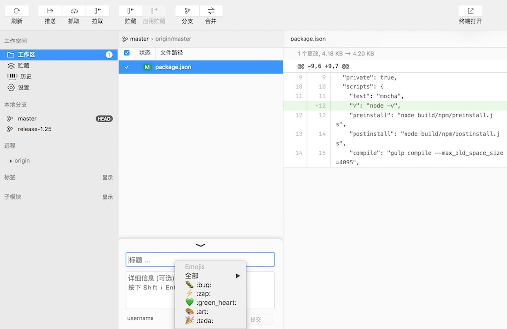
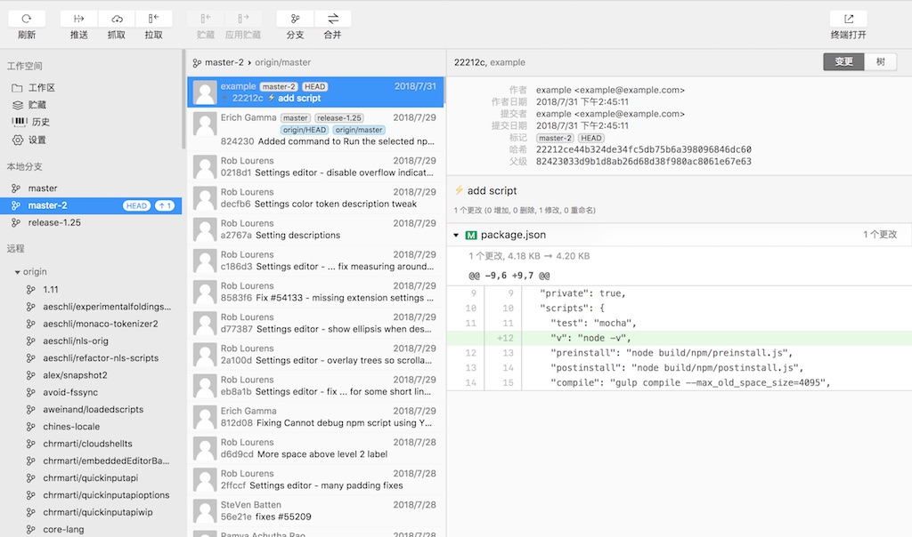
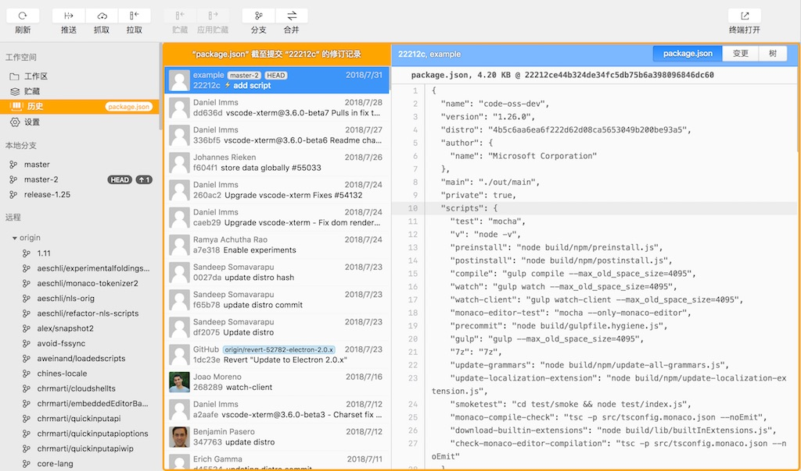
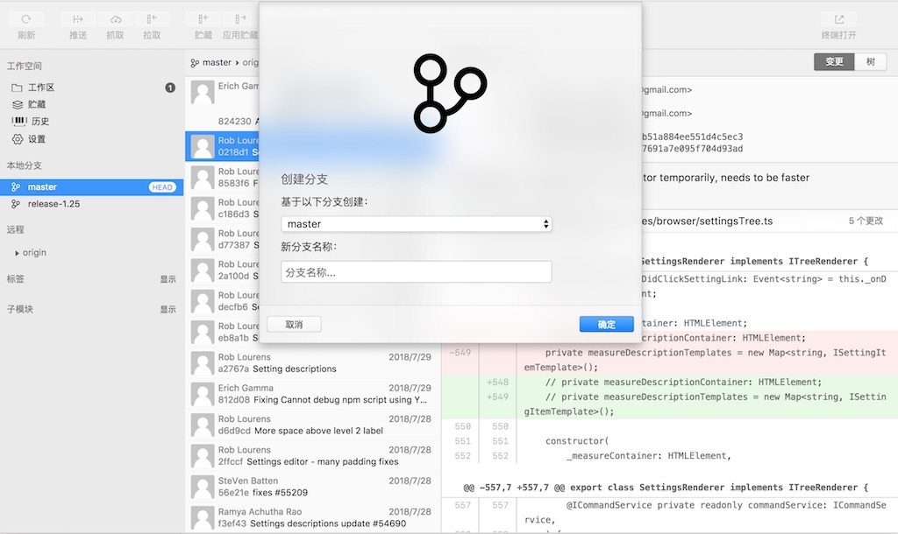
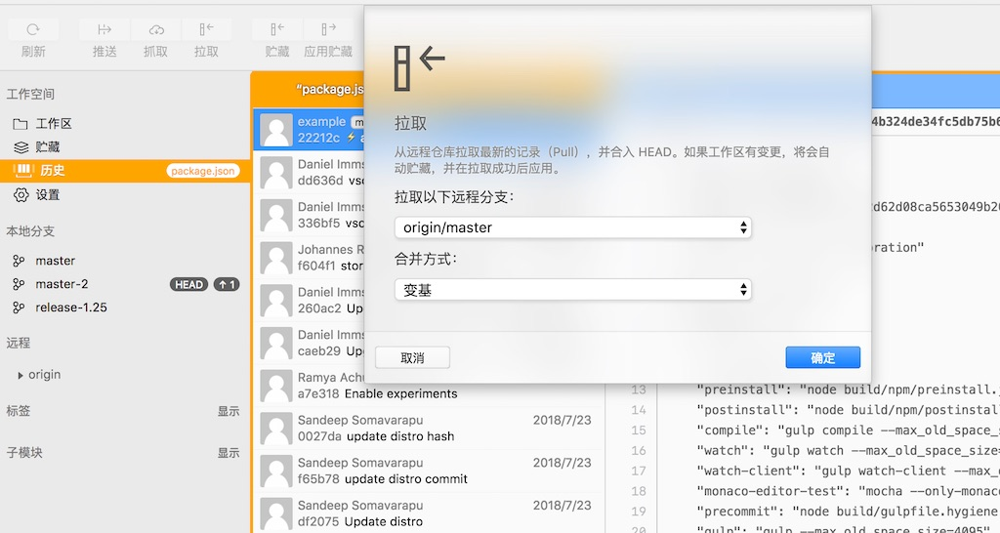
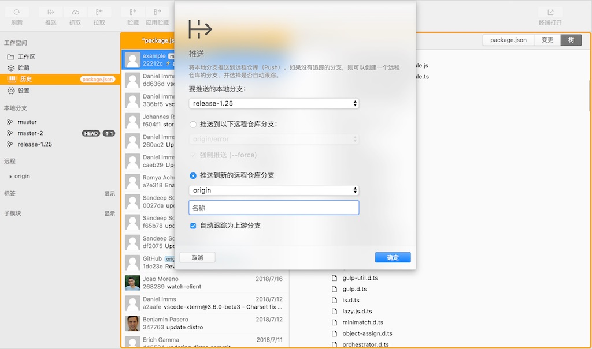
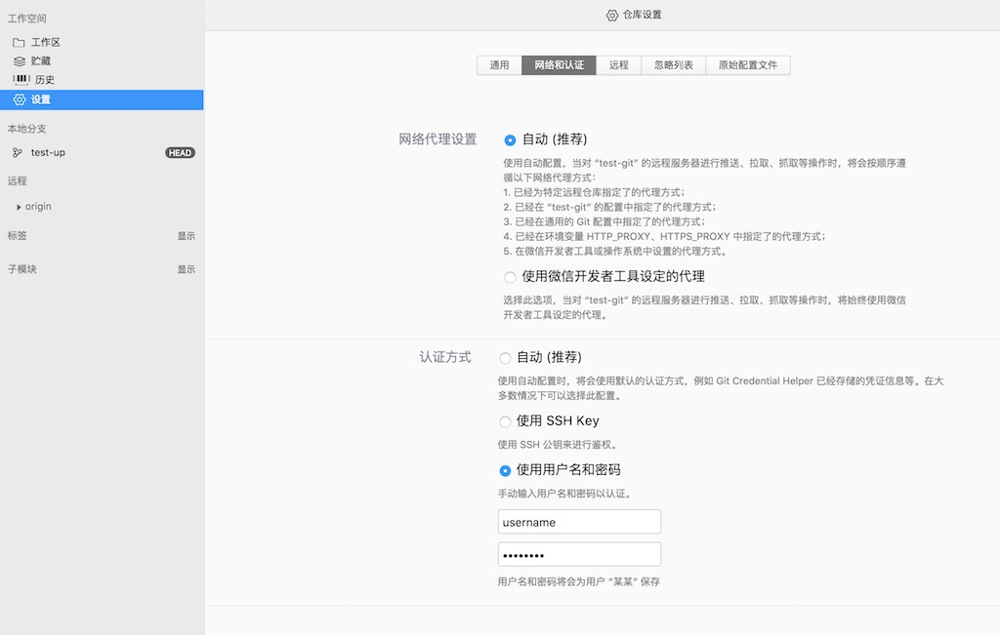
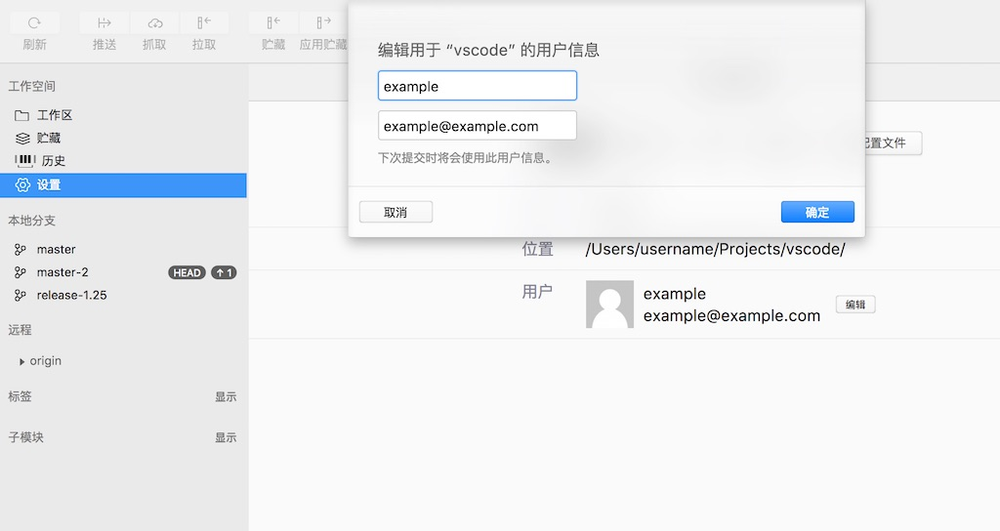
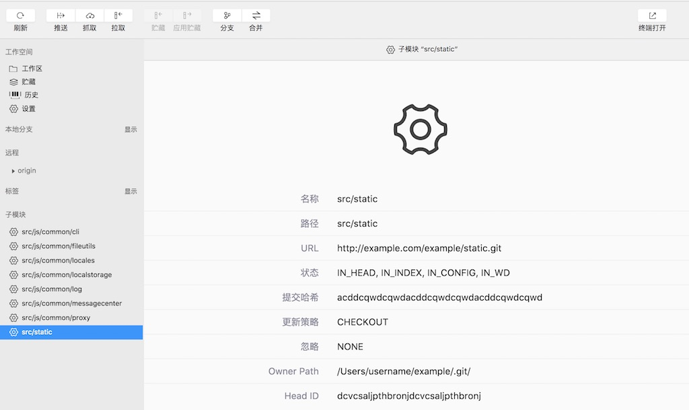
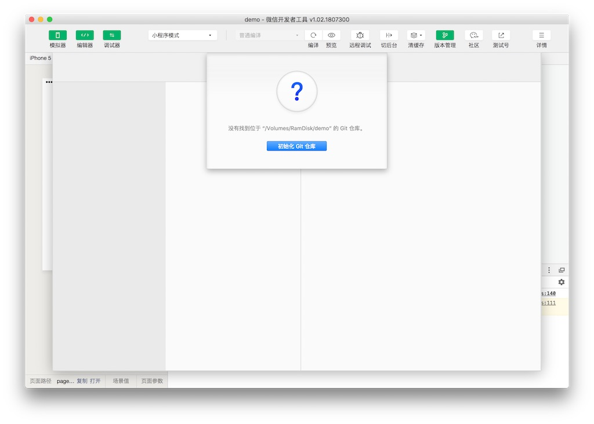

## Git 版本管理

为了方便开发者更简单快捷地进行代码版本管理，简化一些常用的 Git 操作，以及降低代码版本管理使用的学习成本，开发者工具集成了 Git 版本管理面板。体验此功能需要使用 [beta 版开发者工具](./beta.md)。

开发者可以在打开的项目窗口里，点击工具栏上的 “版本管理” 按钮进入 Git 版本管理界面。

### 提交工作区更改

在 “工作区” 可以查看到目前工作目录的变更及对比，并直接通过勾选文件前面的复选框将其添加到暂存区。右键点击工作区或者此文件，可以丢弃修改。输入提交标题和详情，点击提交按钮即可以提交本次的变更。在标题栏上点击右键可以使用常用的 Gitmoji 符号。

### 查看历史

点击历史或者某个分支，可以查看到当前分支的最新提交记录。每个提交记录都可以看到变更的内容以及目录树详情。展开目录树后，在文件上右键点击，可以保存该提交版本的文件完整内容，或者检出该版本的文件。

### 查看文件修改历史

在提交记录的目录树文件上右键点击，可以查看到某个文件截至该提交的所有变更记录，并可直接查看文件内容，方便排查问题。

### 检出和创建分支

要检出某分支，直接在分支上点击右键选择 “检出” 即可。要创建分支，可以在要创建的提交记录或者分支名上右键，选择 “创建分支” 即可。

### 拉取，推送和抓取

通过工具栏上的拉取，推送和抓取按钮，可以很方便地对远程仓库执行各种操作。某些远程仓库可能需要身份验证或者网络代理配置，可以在 “设置” 页中 “网络和认证” 中配置这些信息。

 

### 网络和认证设置

如果连接远程仓库需要代理或者用户身份验证的设置，可以在设置 “网络和认证” 中配置。

### 用户设置

在设置页面可以对用户名进行配置。配置完成后，下次提交时，将会使用此用户名和邮箱进行提交。

### 子模块

如果项目包含子模块 (Submodule)，可以在子模块列表下查看到子模块的信息。目前不支持对子模块进行更多的操作。

### 初始化 Git 仓库

如果所在的项目文件夹下没有找到 Git 仓库，可以根据提示初始化一个仓库，并可选择是否立即提交所有文件，以及自动生成一个 .gitignore 文件模版。

