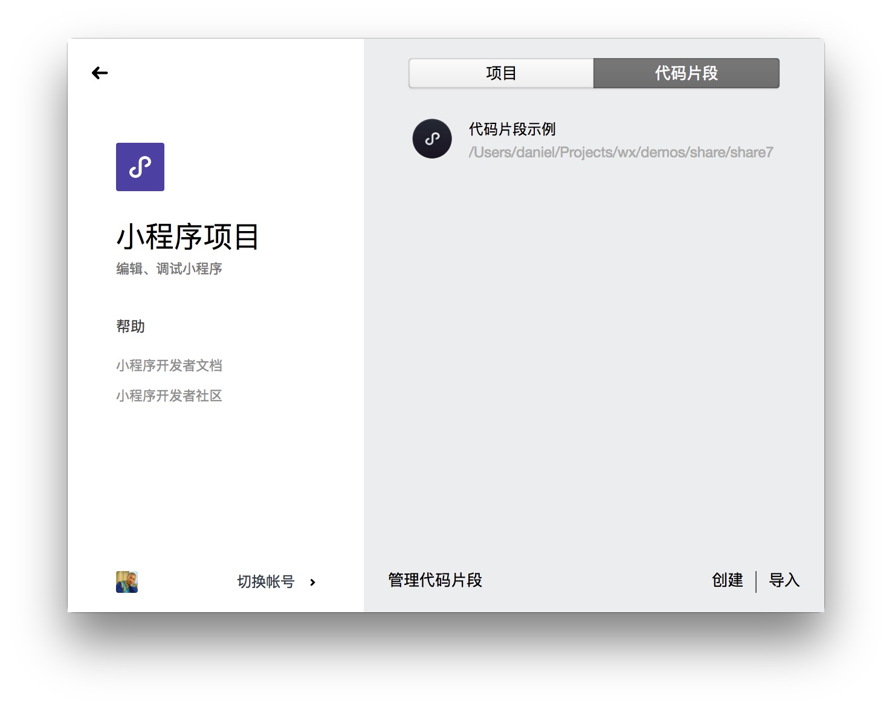
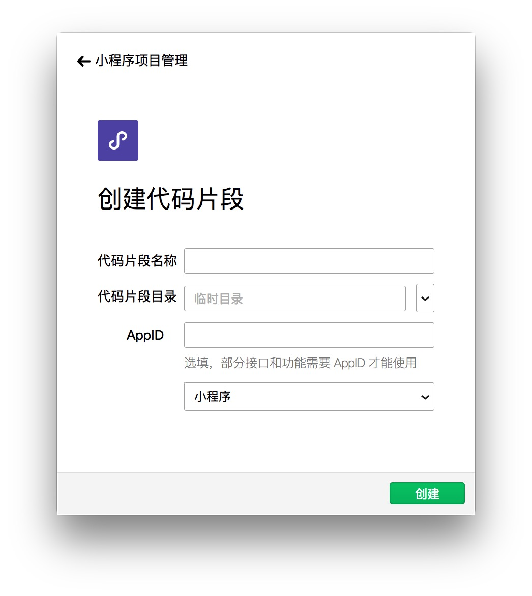
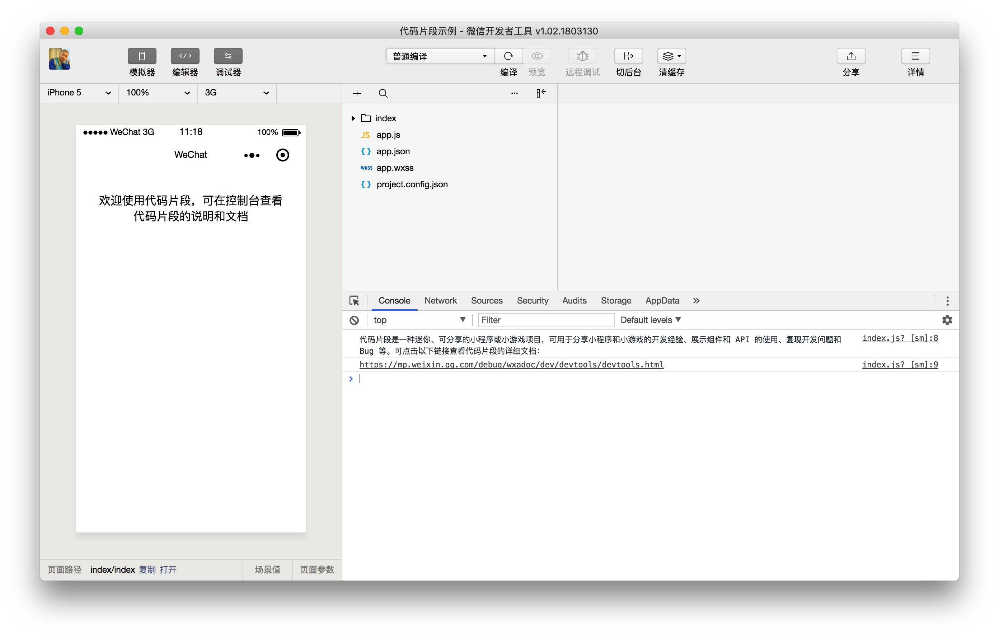
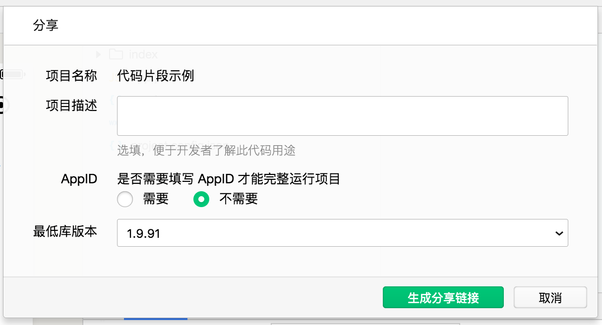
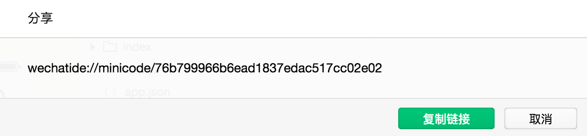
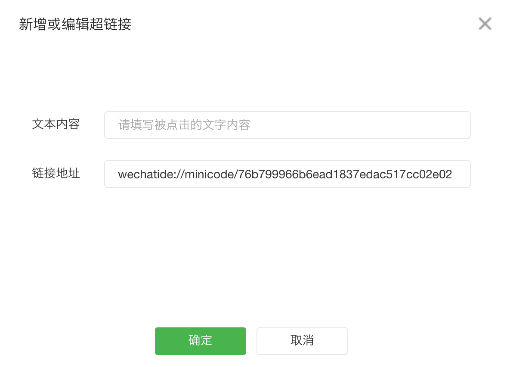
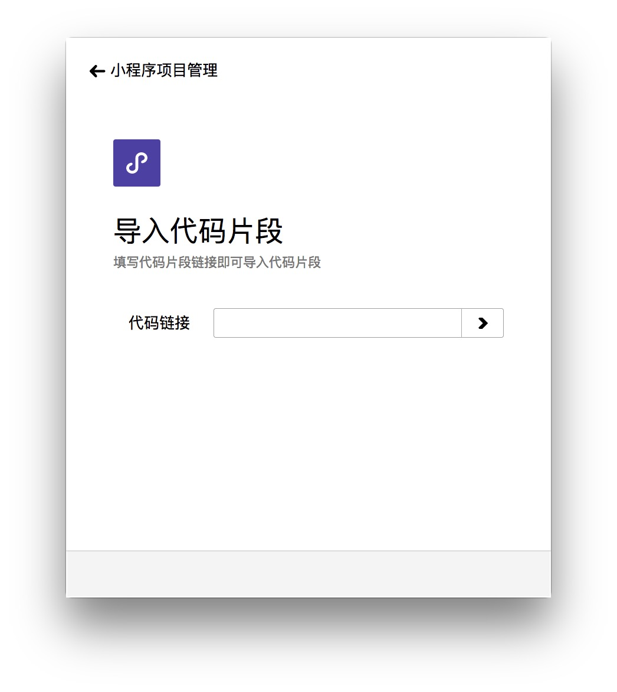
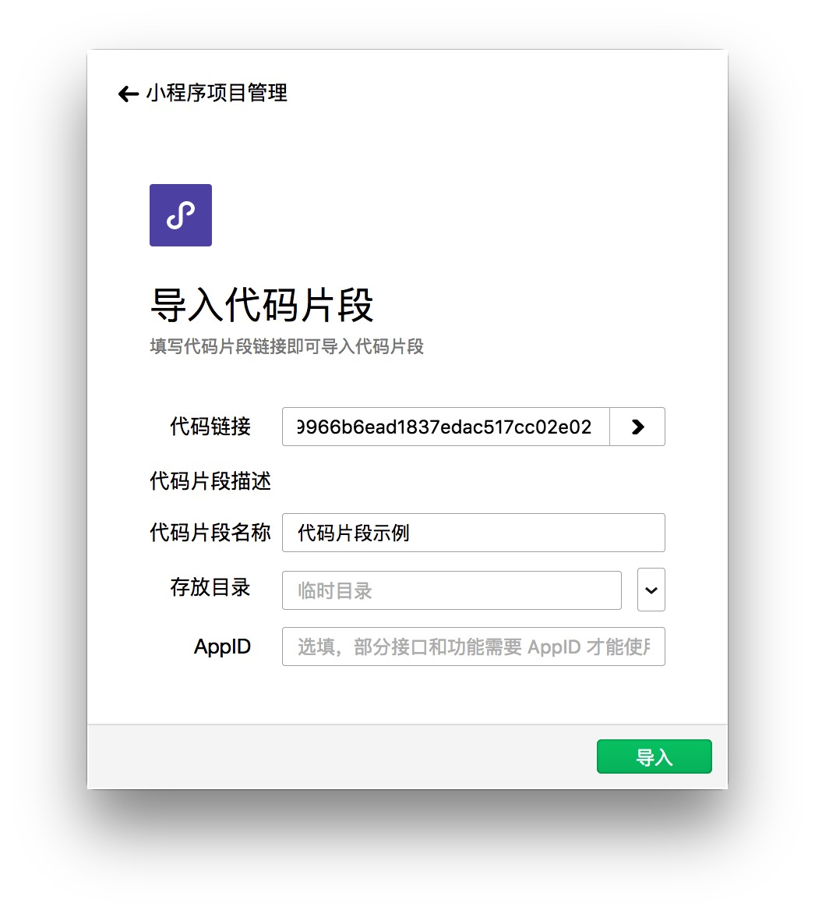

代码片段是一种可分享的小项目，可用于分享小程序和小游戏的开发经验、展示组件和 API 的使用、复现开发问题等等。分享代码片段会得到一个链接，所有拥有此分享链接的人可以在工具中导入此代码片段。如果网页可点击的链接指向的是分享链接，那么点击链接也会自动打开工具进入代码片段导入页。使用最新版的开发者工具可以<a href="wechatide://minicode/a07de76a27e3e7836c4ea39d72f75eda">点此体验导入代码片段</a>。

### 创建代码片段

在工具选择项目的界面中，右侧可以选择代码片段页卡，查看所有本地代码片段，在右下角可以点击创建代码片段。

创建代码片段需要填入代码片段名称、本地存放目录。AppID 不是必填项，如果需要演示依赖 AppID 的操作则需填写。如果存放目录是空目录，则可在下方选择小程序、小游戏等的快速启动模板。

信息填写正确后，点击创建即可完成创建并打开代码片段。

### 代码片段主界面

代码片段的主界面与普通项目主要有以下几点区别：
1. 没有上传、腾讯云和申请测试报告等功能
2. 详情页中会展示上次分享的链接，并可以一键复制
3. 代码片段的快速启动模板与普通项目的快速启动模板不同，体积更小，功能更精简

### 分享代码片段

在工具栏上点击分享按钮即可开启分享代码片段的流程，在分享信息中需要填写以下内容：
- 项目描述：简要介绍此代码片段的功能和目的
- 是否需要 AppID：如果是，开发者导入代码片段时会建议其填入 AppID 以完整运行代码片段
- 最低库版本：开发者打开导入的代码片段时详情页的调试基础库不会低于指定的版本

分享的小程序代码片段最大大小为 100KB，小游戏代码片段最大为 200KB。

分享成功后会展示分享链接，可复制分享给其他开发者，其他开发者在工具中选择导入代码片段并粘贴链接即可导入。

分享的链接除了可以粘贴到导入页导入外，还可以设置为可点击的链接。如果 `html` `<a>` 标签的 `href` 属性设置为分享的链接，如 `<a href="wechatide://minicode/76b799966b6ead1837edac517cc02e02">代码片段示例</a>`，则用户点击此链接时会自动打开工具进入代码片段导入页，最后点击导入即可完成导入。在开发者社区发帖时，如果想要提供 demo 示例，如果想要提供 demo 示例，可以插入一个链接为代码片段分享链接的超链接。

### 导入代码片段

在选择代码片段的页面的右下角可以点击导入进入导入页，或者点击菜单栏上的项目选项卡下的导入代码片段来打开导入页。导入时需要填写分享链接或代码片段 ID。链接的最后一部分即是代码片段的 ID，如 `wechatide://minicode/76b799966b6ead1837edac517cc02e02` 的 ID 为 `76b799966b6ead1837edac517cc02e02`。

导入时可选择存放目录和 AppID。存放目录默认是在临时文件夹。

