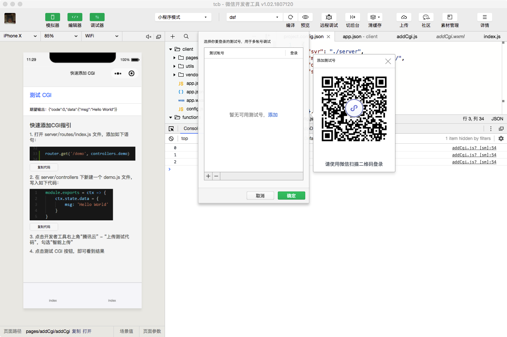
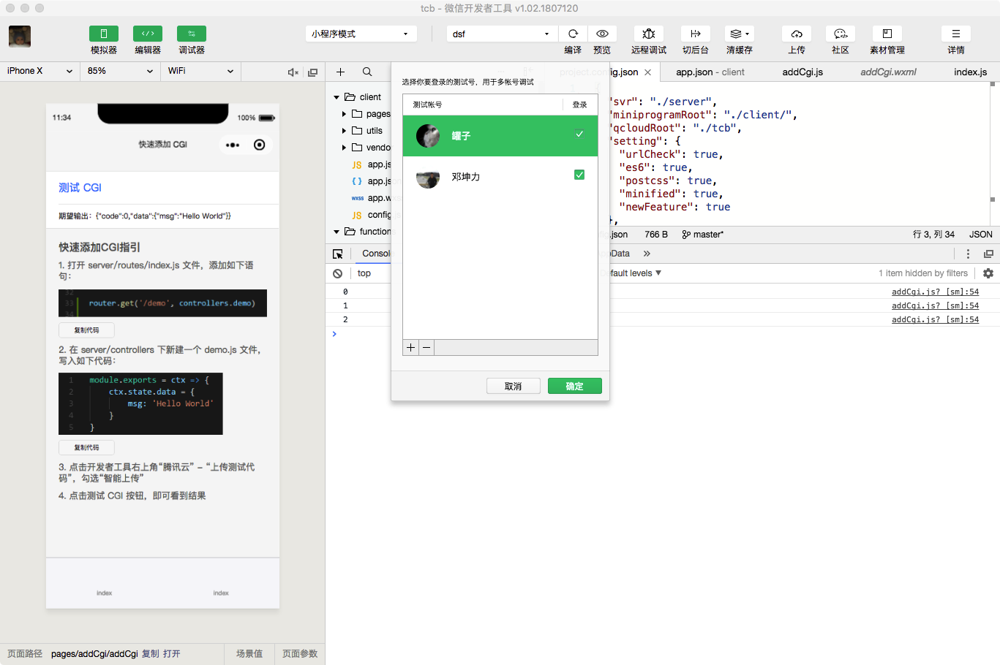
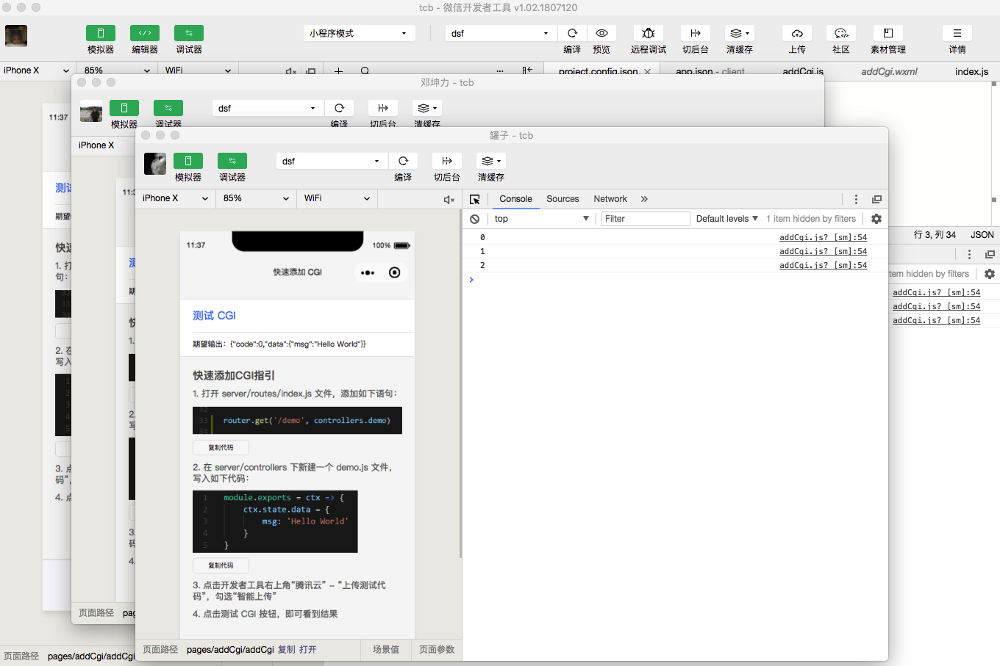

# 功能描述

开发者工具需要使用微信号登录，我们以此帐号作为所有打开的项目的主帐号，当登录的帐号改变时，其登录态将同步到所有已打开的项目窗口；
当小程序/小游戏需要多个微信号才能共同完成一项工作的话，我们提供了多帐号调试的功能。

## 功能入口

通过 菜单 - 工具 - 多帐号调试 可以使用多帐号调试功能

## 如何使用

使用不同于主帐号的微信扫描二维码可以添加一个测试帐号，**如果该测试帐号登录了其他开发者工具客户端，登录态将失效**

点击 ‘+’、‘-’ 我们可以添加多个测试号，或者删除已添加的测试号；按住 ‘ctrl’ 键，鼠标可以多选

我们可以同时勾选多个帐号，打开多个调试窗口来调试同一个项目；调试窗口与项目主窗口不同，只有模拟器和调试器；对项目代码编辑还是需要在项目主窗口进行，代码保存后，各个调试窗口可以同步执行最新的代码

