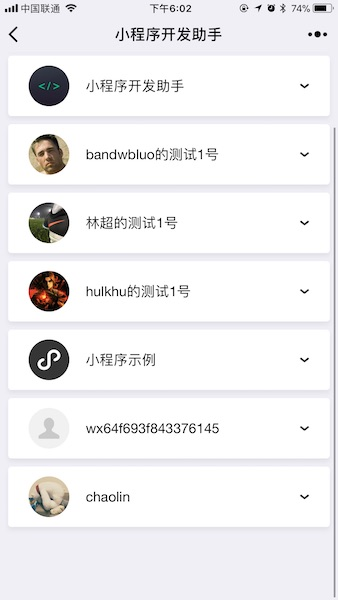
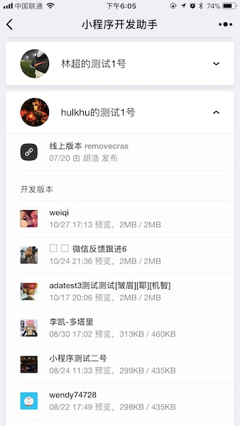

# 功能概述

“小程序开发助手” 是微信公众平台发布的官方小程序，帮助开发和运营人员在手机端更方便快捷地查看和预览小程序，扫描下面小程序码可立即体验。

使用者可以在小程序开发助手查看和预览与自己关联的所有小程序。小程序将会按照其更新时间自动排序，显示在最上面的小程序是最近有提交的小程序，例如开发者预览了新的代码，或者体验版有更新。

通过点击并展开小程序列表，使用者可以根据自己的身份，浏览到小程序的线上版本、体验版本或开发版本。如果使用者是小程序的管理者，可以浏览到全部三种版本；如果使用者身份是 “体验者”，则可以浏览到线上版本、体验版本，而不会浏览到任何开发版本。

如果一个小程序有多个开发者，则开发版本的列表将会显示每一个开发者提交预览的最新版本。

如图，小程序的开发版和体验版会展示提交/发布者、更新时间，以及代码的编译前后大小。

通过点击列表上的相应版本，使用者可以立即预览该版本对应的小程序。点击导航栏的返回，可以返回到小程序开发助手，预览其他版本的小程序。
