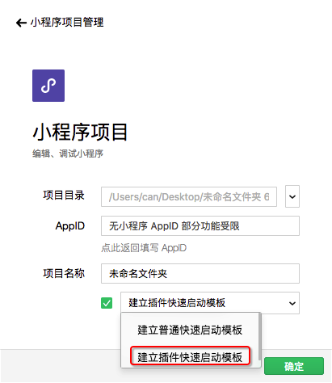

## 创建插件项目

小程序的 AppID 可以创建小程序插件项目，插件是独立于小程序之外的，但是 AppID 是公用的，所以不要使用原有的小程序项目进行插件开发。
在创建项目页面，选择一个空文件夹作为项目路径，可以选择创建小程序插件快速启动模板



快速启动模板说明：

1. `miniprogram` 文件夹是一个普通小程序项目，用来编写小程序插件的使用 Demo，上传插件代码时这个 Demo 会一起上传，并作为小程序插件的发布的审核依据.

2. `plugin` 文件就是小程序插件项目，用来编写小程序插件的代码。

3. `project.config.json` 需要关注 `compileType` 字段，`compileType == 'plugin'` 时才能正常的使用插件项目。[详情](./projectconfig.md)

## 打开已存在的插件项目

如果是之前创建的插件项目，可以在项目列表中直接打开；

如果重新创建项目，选择一个非空目录，那么这个非空目录中需要有 `project.config.json` [详情](./projectconfig.md)，确保这个文件中有以下字段：


```json
{
  "miniprogramRoot": "./miniprogram",
  "pluginRoot": "./plugin",
  "compileType": "plugin"
}
```

在项目开发期间，可以手动修改 `project.config.json` 文件的 `compileType` 字段来切换项目的编译类型。

## 插件上传


上传插件代码前，需要指定版本号，格式为 数字.数字.数字 ，每个数字最大为 999。

每次提交版本号需要递增，插件使用者会用到这个版本号，请谨慎填写。

上传插件时，同时会将 `project.config.json` 中 `miniprogramRoot` 指定的目录的内容作为插件使用 Demo 一起上传，这个 Demo 需要覆盖到插件的所有使用场景，便于插件的审核

## 插件文档编写、预览和上传


插件文档必须放置在插件项目根目录中的 `doc` 目录下，插件文档的入口文件是 `doc/README.md`，在 `README.md` 中引用的图片必须是 `doc` 目录下的本地图片。

在开发者工具中编辑 `README.md` 时，在编辑器底部有预览的入口可以预览插件文档。编辑完成后，可以在 `README.md` 的编辑窗口中使用编辑器底部的上传入口上传插件文档。

## 插件使用

在小程序项目的 `app.json` 的 `plugins` 字段中可以声明使用插件。如果当前的编译类型为小程序时，需要指定已发布的插件的版本号，开发者工具会根据版本号去拉取对应版本的插件进行编译。

只有在 `project.config.json` 的 `compileType == 'plugin'` 时，插件的版本号才能为 `'dev'`
