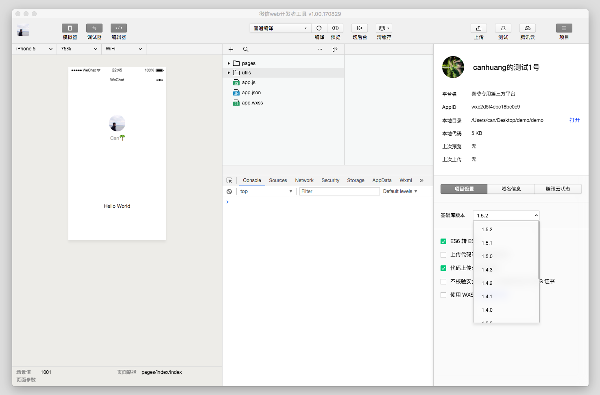
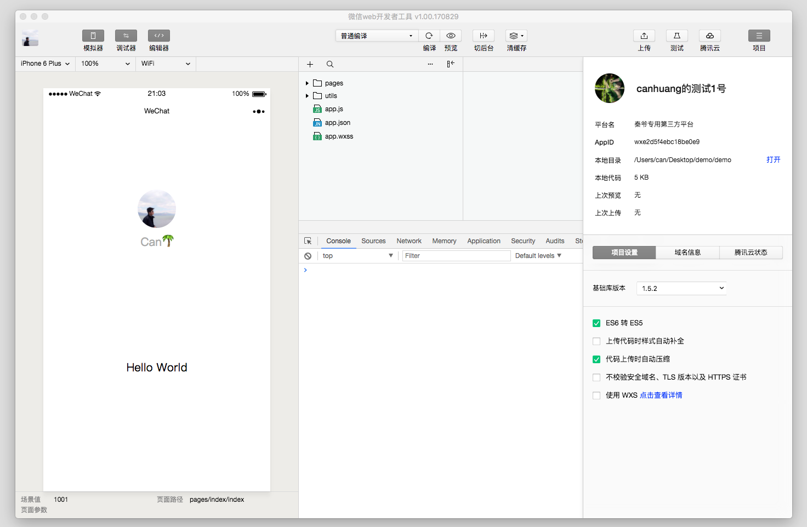
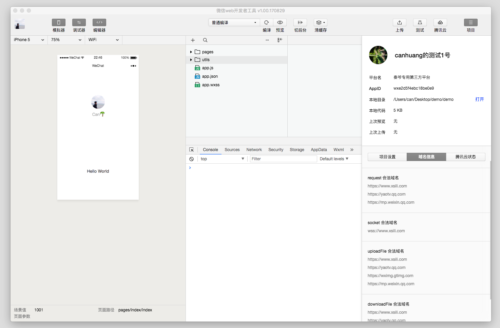
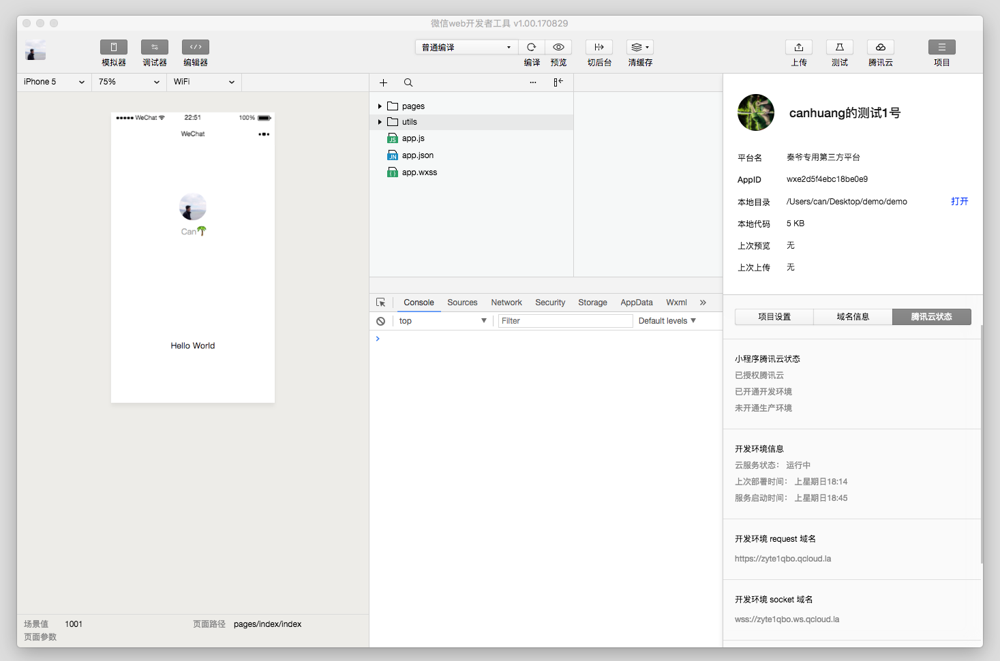

项目页卡主要有三大功能

## 显示当前项目细节

包括图标、AppID、第三方平台名（只有第三方平台的开发小程序才会显示）、目录信息、上次提交代码的时间以及代码包大小。

## 基础库版本切换

开发者可以在此选择任意基础库版本，用于开发和调试旧版本兼容问题。

## 项目设置

微信小程序运行在三端：iOS、Android 和 用于调试的开发者工具。

三端的脚本执行环境以及用于渲染非原生组件的环境是各不相同的：

- 在 iOS 上，小程序的 javascript 代码是运行在 JavaScriptCore 中，是由 WKWebView 来渲染的，环境有 iOS8、iOS9、iOS10
- 在 Android 上，小程序的 javascript 代码是通过 X5 JSCore来解析，是由 [X5](http://x5.tencent.com/guide?id=4000) 基于 Mobile Chrome 53/57 内核来渲染的
- 在 开发工具上， 小程序的 javascript 代码是运行在 nwjs 中，是由 Chrome Webview 来渲染的

尽管三端的环境是十分相似的，但是还是有些许区别：

- `ES6` 语法支持不一致。[详情](./details.md#es6-api-支持情况)
- `wxss` 渲染表现不一致。尽管可以通过开启样式补全来规避大部分的问题 ，还是建议开发者需要在 iOS 和 Android 上分别检查小程序的真实表现。

### ES6 转 ES5

在 0.10.101000 以及之后版本的开发工具中，会默认使用 `babel` 将开发者 `ES6` 语法代码转换为三端都能很好支持的 `ES5` 的代码，帮助开发者解决环境不同所带来的开发问题。

需要注意的是：
- 为了提高代码质量，在开启 `ES6` 转换功能的情况下，默认启用 `javasctipt` 严格模式，请参考  ["use strict"]( https://developer.mozilla.org/en-US/docs/Web/JavaScript/Reference/Strict_mode)

### 样式补全

开启此选项，开发工具会自动检测并补全缺失样式，保证在低版本系统上的正常显示。尽管可以规避大部分的问题 ，还是建议开发者需要在 iOS 和 Android 上分别检查小程序的真实表现。

### 压缩代码

开启此选项，开发工具在上传代码时候将会帮助开发者压缩 `javascript` 代码，减小代码包体积。

### 不校验请求域名及 TLS 版本

正式发布的小程序的网络请求是需要校验合法域名以及域名的 TLS 版本，可以在 mp 管理后台进行配置。
在开发过程中可以开启此选项，开发工具将不会校验安全域名，以及 TLS 版本，帮助在开发过程中更方便的完成调试工作。

### 启用多核心编译

在四核及以上的电脑上此选项可见。启用此选项，会充分利用 CPU 资源来编译项目的 JS 代码，提高编译的效率。可以选择关闭此选项。

## 域名信息

将显示小程序的安全域名信息，合法域名可在 mp 管理后台进行设置。

## 腾讯云状态

使用腾讯云功能，可以在这里看到腾讯云状态、开发环境信息和域名信息。

