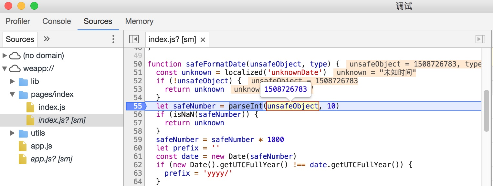

# 功能概述

真机远程调试功能可以实现直接利用开发者工具，通过网络连接，对手机上运行的小程序进行调试，帮助开发者更好的定位和查找在手机上出现的问题。

## 调试流程

要发起一个真机远程调试流程，需要先点击开发者工具的工具栏上 “远程调试” 按钮。

此时，工具会将本地代码进行处理打包并上传，就绪之后，使用手机客户端扫描二维码即可弹出调试窗口，开始远程调试。

## 远程调试窗口

使用手机扫描此二维码，即可开始远程调试。

要结束调试，直接关闭此调试窗口，或点击右下角 “结束调试” 按钮即可。

远程调试窗口分为两部分，分别是左侧的调试器视图、右侧的信息视图。开发者可以在调试器里直接进行代码的调试，并查看 Storage 情况；信息视图则可以查看目前与手机和服务器的连接情况，以及发生的错误信息等。

### 调试器

在远程调试的调试器里，开发者可以在 Console 面板里对代码进行调试，在 Sources 面板里查看小程序的源代码并进行断点单步调试，在 Storage 面板里查看小程序的 Storage 使用情况等。

注意，要在 Console 里对小程序进行调试，需要将调试的上下文切换到 VM Context 1，如图所示。

在 Sources 面板查看源代码时，开发者所有的文件路径都是以 `weapp://` 开头的。

除了可以在调试器进行单步调试，开发者还能在代码中手动插入 `debugger;` 语句进行断点调试。因此，如果想要在小程序启动的尽早时刻断点，可以在进入远程调试之前，编辑代码手动在需要断点处的代码插入 `debugger;` 语句来实现。

WXML、AppData、Storage 面板的操作和开发者工具调试模拟器时的操作一致。注意，如果在右侧信息视图取消勾选了 “使用工具端的 Storage”，则所有的 Storage 数据将被存储在手机上，将不再出现 Storage 面板。

### 信息视图

右侧的信息视图展示了手机、网络连接的信息。手机信息展示手机的型号、系统、名称、微信版本等信息，以及通信延时。通信延时越小，与手机的通信越流畅。

在 “连接信息” 里，展示了工具与服务器的连接信息，包括了连接状态、服务器状态等，当连接故障、服务器阻塞影响到调试的过程和流畅度时，此处将展示这一状态。当连接状态为 “已结束” 时，表明调试已被终止。

“警告和错误” 展示了最近发生的错误和警告信息。如果网络连接断开，此处将会询问开发者是否需要重新连接。

## 手机端展示

调试过程中的手机端展示如下所示。

> 当手机无网络或者进入了断点状态时，将会出现一个浮层提示并阻止进一步的操作。

