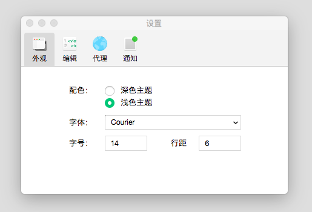
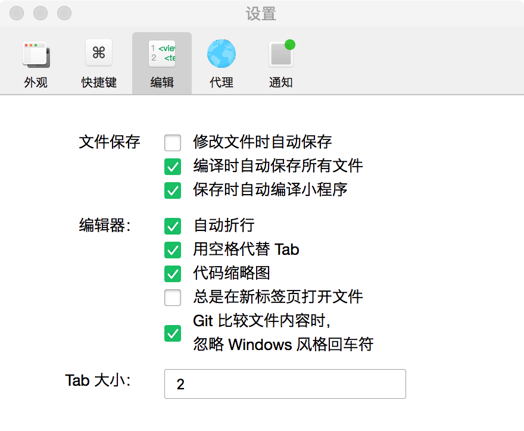
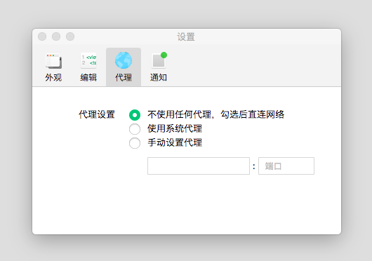
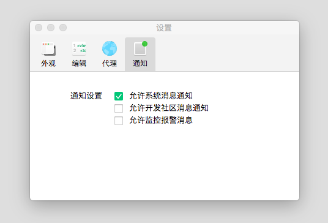

## 设置页

外观设置、编辑设置、代理设置和通知配置。菜单栏上点击设置，或者使用快捷键 `ctrl(⌘) + ,` 可以打开设置页。

### 外观设置

编辑器支持配置外观和代码编辑器习惯和风格。

- 主题：深色、浅色
- 字体
- 字号
- 行距

### 编辑设置

- 修改文件时自动保存
- 编译时自动保存所有文件
- 文件保存时自动编译小程序
- 自动折行
- 用空格代替 Tab
- 代码缩略图
- 总是在新标签页打开文件
- Git 比较文件内容时，忽略 Windows 风格回车符
- Tab 大小

如果选中了 “总是在新标签页打开文件”，则在编辑器目录树点击文件时，总是会在一个新标签页中打开此文件，而非在临时标签页中打开。

### 代理设置

可以配置不使用代理，或使用系统代理，或使用自定义代理。

### 通知设置

可以设置是否接收系统消息、开发者社区消息、监控报警消息。

