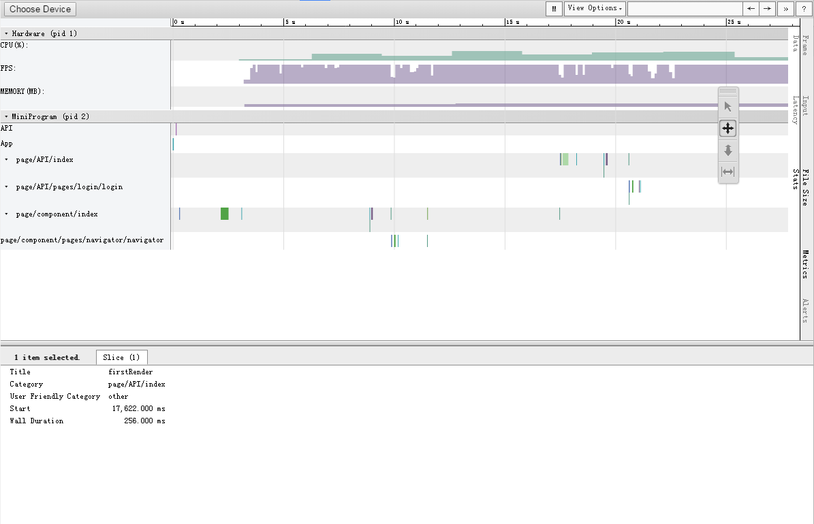
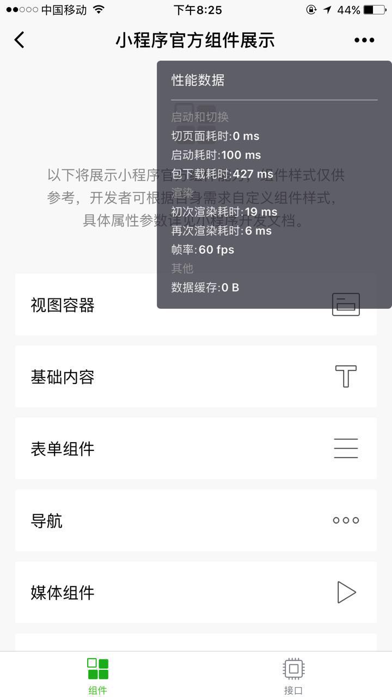

# 性能 Trace 工具

微信 Andoid 6.5.10 开始，我们提供了 Trace 导出工具，开发者可以在开发者工具 Trace Panel 中使用该功能。

## 使用方法

1. PC 上需要先安装 `adb` 工具，可以参考一些主流教程进行安装，Mac 上可使用 brew 直接安装。
2. 确定 `adb` 工具已成功安装后，在开发者工具上打开 Trace Panel，将 Android 手机通过 USB 连接上 PC，点击「Choose Devices」，此时手机上可能弹出连接授权框，请点击「允许」。
3. 选择设备后，在手机上打开你需要调试的开发版小程序，通过右上角菜单，打开性能监控面板，重启小程序；
4. 重启后，在小程序上进行操作，完成操作后，通过右上角菜单，导出 Trace 数据；
5. 此时开发者工具 Trace Panel 上会自动拉取 Trace 文件，选择你要分析的 Trace 文件即可；

> 可以通过 `adb devices` 命令确定设备是否已和 PC 建立起连接

# 性能面板

从微信 6.5.8 开始，我们提供了性能面板让开发者了解小程序的性能。开发者可以在开发版小程序下打开性能面板，打开方法：进入开发版小程序，进入右上角更多按钮，点击「显示性能窗口」。

## 性能面板指标说明

| 指标         | 说明                                                 |
| ------------ | ---------------------------------------------------- |
| CPU          | 小程序进程的 CPU 占用率，仅 Android 下提供           |
| 内存         | 小程序进程的内存占用（Total Pss)，仅 Android 下提供  | 
| 启动耗时     | 小程序启动总耗时                                     |
| 下载耗时     | 小程序包下载耗时，首次打开或资源包需更新时会进行下载 |
| 页面切换耗时 | 小程序页面切换的耗时                                 |
| 帧率/FPS     |                                                      |
| 首次渲染耗时 | 页面首次渲染的耗时                                   |
| 再次渲染耗时 | 页面再次渲染的耗时（通常由开发者的 setData 操作触发）|
| 数据缓存     | 小程序通过 Storage 接口储存的缓存大小                |
