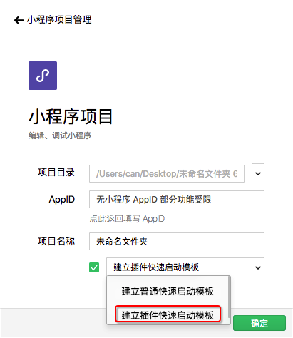

# 开发插件

开发插件前，请阅读了解[《小程序插件接入指南》](https://developers.weixin.qq.com/miniprogram/introduction/plugin.html)了解开通流程及开放范围，并开通插件功能。如果未开通插件功能，将无法上传插件。

## 创建插件项目

插件类型的项目可以在开发者工具中直接创建。[详情](../../devtools/plugin.md)



新建插件类型的项目后，如果创建示例项目，则项目中将包含两个目录：

* `plugin` 目录：插件代码目录。
* `miniprogram` 目录：放置一个小程序，用于调试插件。
* 此外，还可以加入一个 `doc` 目录，用于放置插件开发文档。

`miniprogram` 目录内容可以当成普通小程序来编写，用于插件调试、预览和审核。下面的内容主要介绍 `plugin` 的编写方法。

## 插件目录结构

一个插件可以包含若干个自定义组件、页面，和一组js接口。插件的目录内容如下：

```
plugin
├── components
│   ├── hello-component.js   // 插件提供的自定义组件（可以有多个）
│   ├── hello-component.json
│   ├── hello-component.wxml
│   └── hello-component.wxss
├── pages
│   ├── hello-page.js        // 插件提供的页面（可以有多个，自小程序基础库版本  开始支持）
│   ├── hello-page.json
│   ├── hello-page.wxml
│   └── hello-page.wxss
├── index.js                 // 插件的 js 接口
└── plugin.json              // 插件配置文件
```

## 插件配置文件

插件配置文件 `plugin.json` 主要说明有哪些自定义组件可以供插件外部调用，并标识哪个js文件是插件的js接口文件，如：

**代码示例：**

```json
{
  "publicComponents": {
    "hello-component": "components/hello-component"
  },
  "pages": {
    "hello-page": "pages/hello-page"
  },
  "main": "index.js"
}
```

## 插件页面跳转

插件的页面从小程序基础库版本  开始支持。

插件执行页面跳转的时候，可以使用 `navigator` 组件。当插件跳转到自身页面时， `url` 应设置为这样的形式：`plugin-private://PLUGIN_APPID/PATH/TO/PAGE` 。需要跳转到其他插件时，也可以这样设置 `url` 。

**代码示例：**

```html
<navigator url="plugin-private://wxidxxxxxxxxxxxxxx/pages/hello-page">
  Go to pages/hello-page!
</navigator>
```

自基础库版本  开始，在插件自身的页面中，插件还可以调用 `wx.navigateTo` 来进行页面跳转， `url` 格式与使用 `navigator` 组件时相仿。

## 插件对外接口

插件内的自定义组件与普通的自定义组件相仿。插件可以定义若干个自定义组件，这些自定义组件都可以在插件内相互引用。其中，提供给外部使用的自定义组件，必须在插件配置文件中显式声明。

插件的 js 接口文件 `index.js` 中可以 export 一些 js 接口，插件的使用者可以使用 `requirePlugin` 来获得这些接口。

**代码示例：**

```js
module.exports = {
  hello: function() {
    console.log('Hello plugin!')
  }
}
```

## 预览、上传和发布

插件可以像小程序一样预览和上传，但插件没有体验版。

插件会同时有多个线上版本，由使用插件的小程序决定具体使用的版本号。

注意：目前，手机预览插件时将使用一个特殊分配的小程序（即“插件开发助手”）来套用这个插件，这个小程序的 appid 与插件的 appid 不同。服务器端处理插件的网络请求时请留心这个问题。

## 插件开发文档

除了插件代码本身，小程序开发者可以另外上传一份插件开发文档。这份文档必须放置在插件项目根目录中的 `doc` 目录下，目录结构如下：

```
doc
├── README.md   // 插件文档，应为 markdown 格式
└── picture.jpg // 其他资源文件，仅支持图片
```

其中，引用到的图片资源不能是网络图片，必须放在这个目录下。编辑 `README.md` 之后，可以使用开发者工具预览插件文档和单独上传插件文档。

在开发者工具中上传文档之后，文档不会立刻发布。此时可以使用帐号和密码登录 [管理后台](https://mp.weixin.qq.com) ，在 小程序插件 > 基本设置 中预览、发布插件文档。

## 插件请求签名

插件在使用 `wx.request` 等 API 发送网络请求时，将会额外携带一个签名 `HostSign` ，用于验证请求来源于小程序插件。这个签名位于请求头中，形如：

```js
X-WECHAT-HOSTSIGN: {"noncestr":"NONCESTR", "timestamp":"TIMESTAMP", "signature":"SIGNATURE"}
```

其中， `NONCESTR` 是一个随机字符串， `TIMESTAMP` 是生成这个随机字符串和 `SIGNATURE` 的 UNIX 时间戳。它们是用于计算签名 `SIGNATRUE` 的参数，签名算法为：

```js
SIGNATURE = sha1([APPID, NONCESTR, TIMESTAMP, TOKEN].sort().join(''))
```

具体来说，这个算法分为几个步骤：

1. `sort` 对 `APPID` `NONCESTR` `TIMESTAMP` `TOKEN` 四个值表示成字符串形式，按照字典序排序（同 JavaScript 数组的 sort 方法）；
1. `join` 将排好序的四个字符串直接连接在一起；
1. 对连接结果使用 `sha1` 算法，其结果即 `SIGNATURE` 。

插件开发者可以在服务器上使用这个算法校验签名。其中， `APPID` 是所在小程序的 AppId （可以从请求头的 `referrer` 中获得）； `TOKEN` 是插件 Token ，可以在小程序插件基本设置中找到。

自基础库版本  开始，在小程序运行期间，若网络状况正常， `NONCESTR` 和 `TIMESTAMP` 会每 10 分钟变更一次。如有必要，可以通过判断 `TIMESTAMP` 来确定当前签名是否依旧有效。
