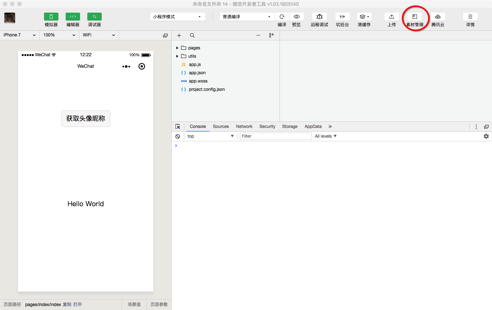
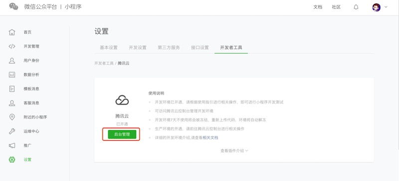
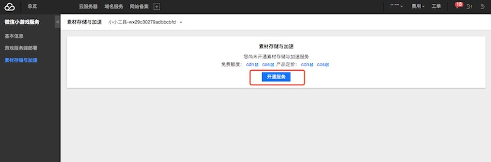

## 素材管理

素材管理将为你一键开通腾讯云的 "对象存储（COS）" 和 "内容分发网络（CDN）" 的产品功能：

- 支持从 微信开发者工具 上传素材到腾讯云；
- 提供临时域名供你在开发过程中调试；
- 提供简单页面管理和上传你的素材资源；
- 赠送一定免费的额度供开发和调试；

## 名词解释

- 对象存储（COS）：是腾讯云为企业和个人开发者们提供的一种能够存储海量数据的分布式存储服务，用户可随时通过互联网对您的大量数据进行批量存储和处理。
- 内容分发网络（CDN）：是腾讯云针对门户网站、电子商务、UGC  社区等业务场景，提供的静态内容（如网页样式、图片、小文件）加速分发处理能力，极大地缩减了站点响应时间，实现复杂内容秒级加载，显著提升了网页用户的体验。
- 外网下行流量：指直接通过对象域名链接下载对象或通过静态网站地址浏览对象产生的流量
- CDN 回源流量：指将存储在 COS 上的文件，分发同步到 CDN 的流量，整个同步过程由系统自动完成。
- 加速域名: 在开启 CDN 加速后，腾讯云会默认生成一条 CDN 加速域名供开发者使用，通过该域名可以直接访问开发者上传的素材文件，若需要领用开通后前 6 个月每个月 50GB免费流量，需要开发者绑定自己备案的域名，[详情](https://cloud.tencent.com/document/product/228/3149#.E7.AC.AC.E4.BA.8C.E6.AD.A5.EF.BC.9A.E6.8E.A5.E5.85.A5.E5.9F.9F.E5.90.8D)。

## 免费额度

 - **对象存储（COS）**: 每月提供免费资源包括： 50 GB 存储空间，10 GB 外网下行流量，10 GB 腾讯云 CDN 回源流量,
   100 万次 读请求， 100 万次 写请求，点击 [了解详情](https://cloud.tencent.com/document/product/436/6240)
 - **内容分发网络（CDN）**: 新开通 CDN 的用户在开通后的 6 个月内每月收到腾讯云赠送的 50GB 流量包，此外接入加速域名后用户每月均可享受 10GB 免费流量包，自接入加速域名后于每月1号发放至您的账户。点击 [了解详情](https://cloud.tencent.com/document/product/228/562)

## 收费情况

对象存储（COS）和 内容分发网络（CDN）都属于后付费的产品，开通本服务后，意味着用户同意在不中断服务的情况下，使用付费的服务。当赠送的流量在过期/快用尽的时候系统将统一通知，请留意用量和系统推送的消息，避免在不知情的情况下产生费用。

相关收费情况，请查看下面的文档：

- 对象存储（COS）计费情况 点击 [了解详情](https://cloud.tencent.com/document/product/436/16871)
- 内容分发网络（CDN）计费情况 点击 [了解详情](https://cloud.tencent.com/document/product/228/2949)

## 产品介绍

1. 对象存储（COS）点击 [了解详情](https://cloud.tencent.com/product/cos)
2. 内容分发网络（CDN）点击 [了解详情](https://cloud.tencent.com/product/cdn-scd)

## 开通步骤

### 一、通过微信公众平台授权登录腾讯云

未将小程序授权给腾讯云需要进行前往 [微信公众平台](https://mp.weixin.qq.com) 注册并登录小程序，按如下步骤操作：

- 单击左侧菜单栏中的【设置】
- 单击右侧 Tab 栏中的【开发者工具】
- 单击【腾讯云】，进入腾讯云工具页面，单击【开通】
- 使用小程序绑定的微信扫码即可将小程序授权给腾讯云，开通之后会自动进去腾讯云微信小程序控制台，显示开发环境已开通，此时可以进行后续操作

### 二、前往腾讯云开通 素材管理 服务

- 单击【腾讯云】logo 下方的 【后台管理】按钮，进入腾讯云管理界面
- 进入小游戏服务页面 [https://console.cloud.tencent.com/lagame](https://console.cloud.tencent.com/lagame)，点击【开通服务】

*注：小程序管理员在 mp 管理后台跳转到腾讯云管理界面后，浏览器中输入 https://console.cloud.tencent.com/lagame 跳转到开通页面*
