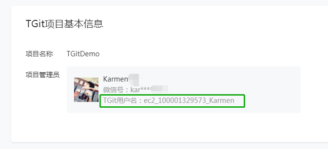

## 名词解释

[Git](https://git-scm.com)：是一个免费开源的分布式版本控制系统。我们可以使用 Git 管理我们的小程序代码。

[TGit](https://cloud.tencent.com/document/product/612/11023)：是腾讯云提供的基于 Git 的在线代码托管服务。

## TGit开通及配置流程

1.开通TGit

   开发者可登录小程序管理后台，在 “设置-开发者工具” 内开通 TGit 功能。

   

2.配置项目信息、管理员信息

   填写小程序项目名称。小程序管理员将作为 TGit 项目管理员，可自定义管理员的用户名和密码。

   **用户名配置完成后，会生成完整的 TGit 用户名，用于在 TGit 内验证身份，可在权限控制页面查看完整用户名。**

   

   提交后，查看完整的 TGit 用户名，TGit 内验证身份需要填写完整用户名。

   

   ​

3.开通后，进入“查看权限”，可查看和配置 TGit 项目成员信息

   

4.添加 TGit 项目成员

   (1)选择成员：通过微信号搜索，选择小程序的一个开发者添加到项目中。

   

   (2)填写 TGit 用户名

   填写用户名，**注意：在添加成员后，可在成员配置页面查看成员完整的用户名，使用 git clone 命令时需要使用完整的用户名进行验证。**

**注：开通 TGit，添加项目成员操作耗时较久，请耐心等待**

## 微信开发者工具

在微信开发者工具的工具栏上可以通过 “代码仓库” 按钮快速进入 TGit 管理后台

## 如何使用

1. 下载并安装 Git，[https://git-scm.com/downloads](https://git-scm.com/downloads)
1. 熟悉 Git 使用方法，[详情](https://git-scm.com/doc)
1. 使用 Git 命令或者 Git 可视化工具将代码提交到 TGit
1. 使用 TGit 进行代码托管和多人协作

