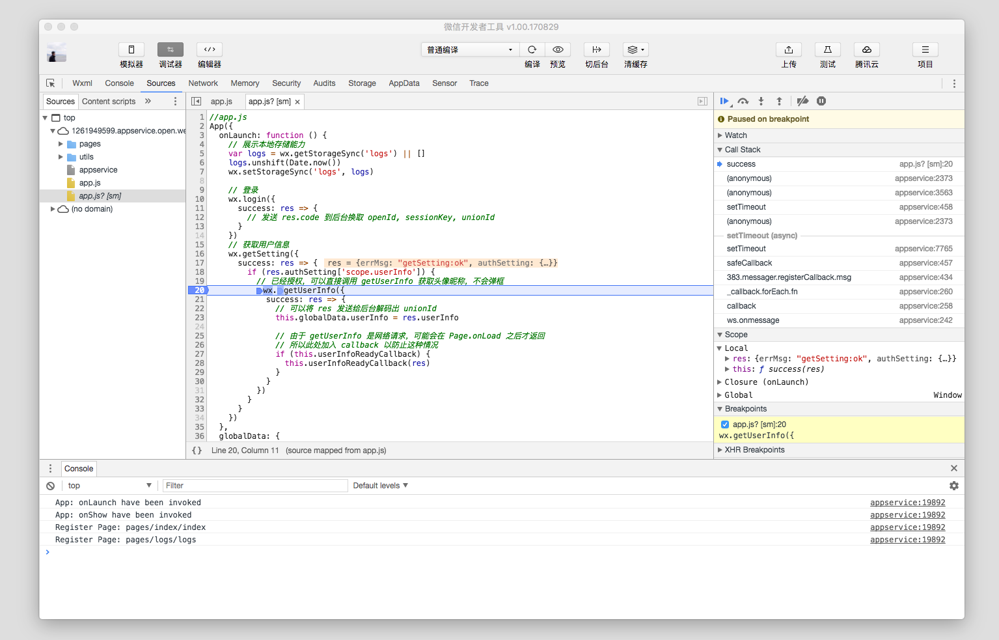
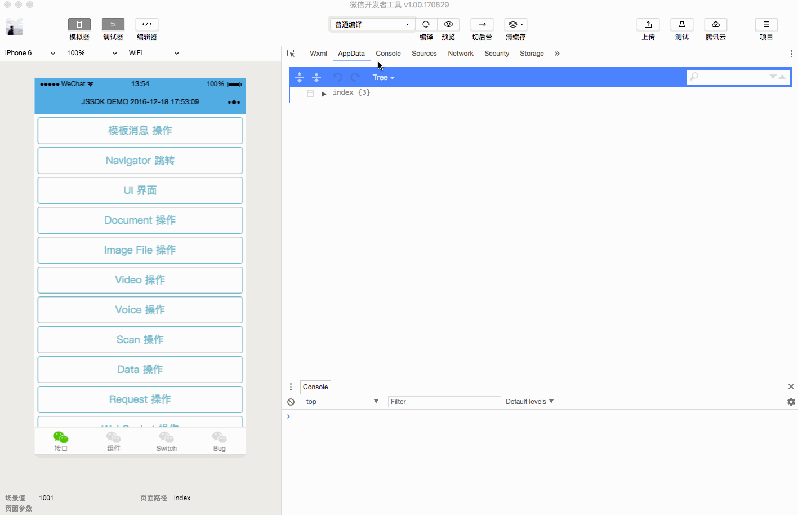
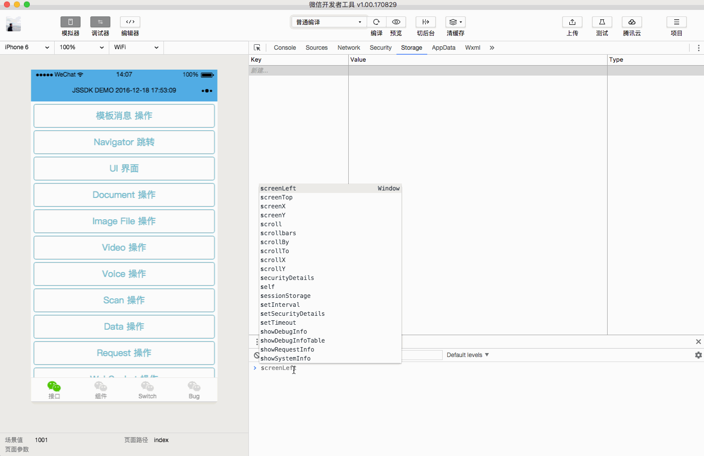
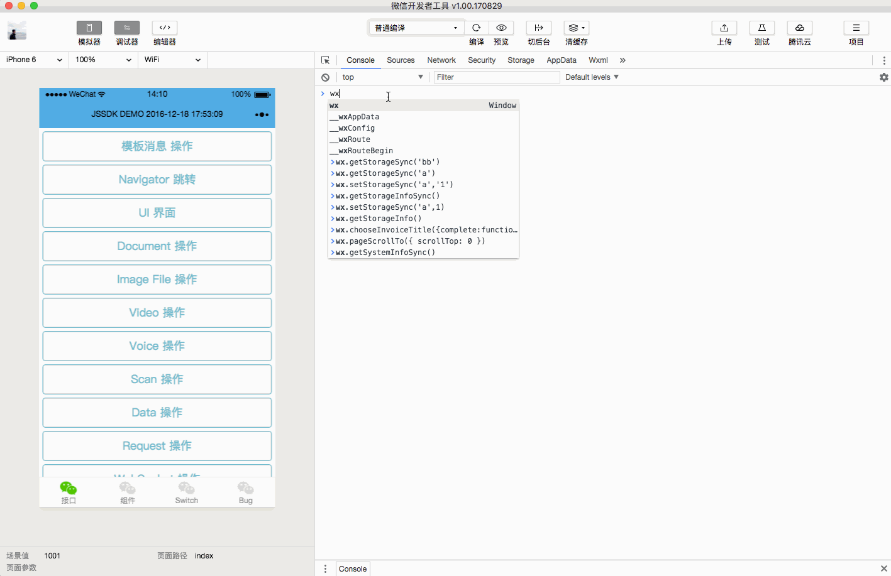
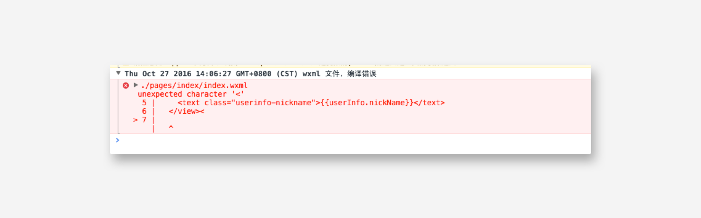

调试是程序开发中必不可少的一个环节，小程序也不例外。

### 使用开发者工具调试

开发者工具主要有四大功能区：模拟器、调试工具、编辑器以及顶部的操作区。

#### 模拟器

模拟器模拟微信小程序在客户端真实的逻辑表现，对于绝大部分的 API 均能够在模拟器上呈现出正确的状态。

#### 调试工具

调试工具分为 7 大功能模块：Wxml、Console、Sources、Network、Appdata、Storage、Sensor、Trace

##### Wxml panel

Wxml panel 用于帮助开发者开发 wxml 转化后的界面。在这里可以看到真实的页面结构以及结构对应的 wxss 属性，同时可以通过修改对应 wxss 属性，在模拟器中实时看到修改的情况（仅为实时预览，无法保存到文件）。通过调试模块左上角的选择器，还可以快速定位页面中组件对应的 wxml 代码。

##### Sources panel

Sources panel 用于显示当前项目的脚本文件，同浏览器开发不同，微信小程序框架会对脚本文件进行编译的工作，所以在 Sources panel 中开发者看到的文件是经过处理之后的脚本文件，开发者的代码都会被包裹在 define 函数中，并且对于 Page 代码，在尾部会有 require 的主动调用。

**注：当代码运行到断点的时候，整个小程序都停止了，所以模拟器会出现白屏或者无法操作的情况**

##### AppData panel

AppData panel 用于显示当前项目运行时小程序 AppData 具体数据，实时地反映项目数据情况，可以在此处编辑数据，并及时地反馈到界面上。

##### Storage panel

Storage panel 用于显示当前项目使用 `wx.setStorage` 或者 `wx.setStorageSync` 后的数据存储情况。

可以直接在 Storage panel 上对数据进行删除（按 delete 键）、新增、修改

##### Network panel

Network Panel 用于观察和显示 request 和 socket 的请求情况

**注：uploadFile 和 downloadFile 暂时不支持在 Network Panel 中查看**

##### Console panel

Console panel 有两大功能：

- 开发者可以在此输入和调试代码

  

- 小程序的错误输出，会显示在此处

  

- 在控制台中可以输入以下命令

> build: 编译小程序

> preview: 预览

> upload: 上传代码

> openVendor: 打开基础库所在目录

> openToolsLog: 打开工具日志目录

> checkProxy(url): 检查指定 url 的代理使用情况

##### Sensor panel

Sensor panel 有两大功能：

- 开发者可以在这里选择模拟地理位置

  

- 开发可以在这里模拟移动设备表现，用于调试重力感应 API

  

通过这个章节你了解到开发者工具上的调试功能的介绍。维护一个小程序，你们可能是一个团队进行协作开发的，在[下个章节](./role.md)，你会了解到更多关于身份管理的细节。

