## 小程序插件功能介绍

插件，是可被添加到小程序内直接使用的功能组件。开发者可以像开发小程序一样开发一个插件，供其他小程序使用。同时，小程序开发者可直接在小程序内使用插件，无需重复开发，为用户提供更丰富的服务。

如需开发插件，请阅读[开发插件](#开发插件)部分；如需使用插件，请阅读[使用插件](#使用插件)部分。

## 开发插件

### 开放范围及服务类目

开放范围：企业、媒体、政府及其他组织主体的小程序

开发者可选择当前小程序帐号已选类目中的一个，作为插件的服务类目。以下为当前已开放的插件服务类目，将逐步开放更多类目。

| 一级类目   | 二级类目                                     | 特殊说明             |
| ------ | :--------------------------------------- | ---------------- |
| 快递业与邮政 | 所有二级类目                                   |                  |
| 教育     | 所有二级类目                                   |                  |
| 医疗     | 就医服务、互联网医院                               | 仅医疗类小程序可使用       |
| 政务民生   | 所有二级类目                                   |                  |
| 金融业    | 征信业务、保险                                  |                  |
| 出行与交通  | 所有二级类目                                   |                  |
| 生活服务   | 票务、生活缴费、休闲娱乐                             |                  |
| IT科技   | 所有二级类目                                   |                  |
| 餐饮     | 点评与推荐、菜谱、餐厅排队、点餐平台、外卖平台                  |                  |
| 旅游     | 所有二级类目                                   |                  |
| 文娱     | 视频、FM/电台、音乐、有声读物、动漫                      |                  |
| 工具     | 记账、投票、日历、天气、备忘录、办公、字典、计算类、报价/比价、发票查询、企业管理、预约/报名、图片/音频/视频、信息查询 |                  |
| 电商平台   | 电商平台                                     |                  |
| 社交     | 笔记、问答、社区/论坛、陌生人社交                        | 仅限社交类目小程序使用      |
| 社交     | 直播                                       | 仅限电商平台、教育类目小程序使用 |
| 商业服务   | 招聘/求职                                    |                  |
| 汽车     | 所有二级类目                                   |                  |

### 插件开发接入流程

以下为插件开发接入流程：

1. [开通插件功能](#开通插件功能)
2. [填写开发信息并开发](#填写开发信息并完成开发)
3. [完善基本信息](#完善基本信息)
4. [提交审核、发布](#提交审核、发布)
5. [管理插件使用申请](#管理插件使用申请)

#### 开通插件功能

小程序开发者无需重新注册帐号，可直接在小程序管理后台开通插件功能，完成基本信息填写后完成开通。

开通入口：小程序管理后台-小程序插件

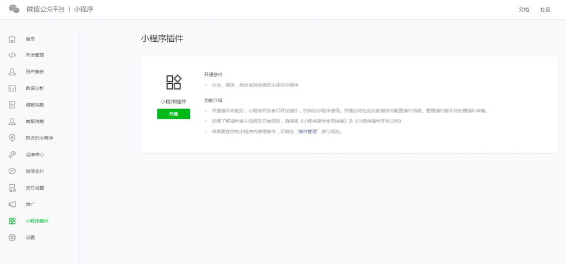

填写插件基本信息，插件的基本信息将在插件申请流程、小程序基本信息页中展示。

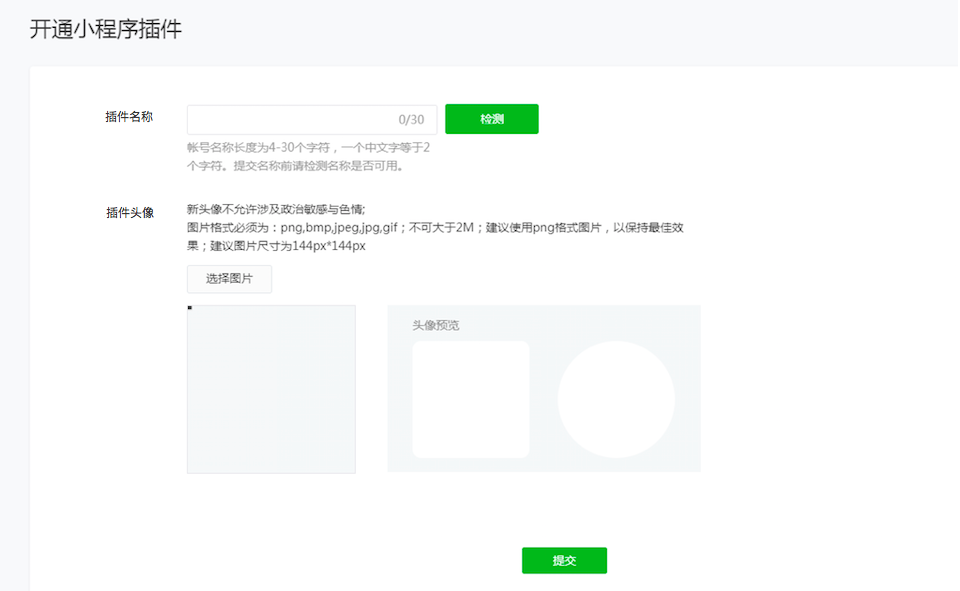

#### 填写开发信息并完成开发

设置插件的服务器域名及Token信息后，即可在开发者工具中开发插件。

开发者工具内设置请见：[《插件开发指南》](https://developers.weixin.qq.com/miniprogram/dev/devtools/plugin.html)

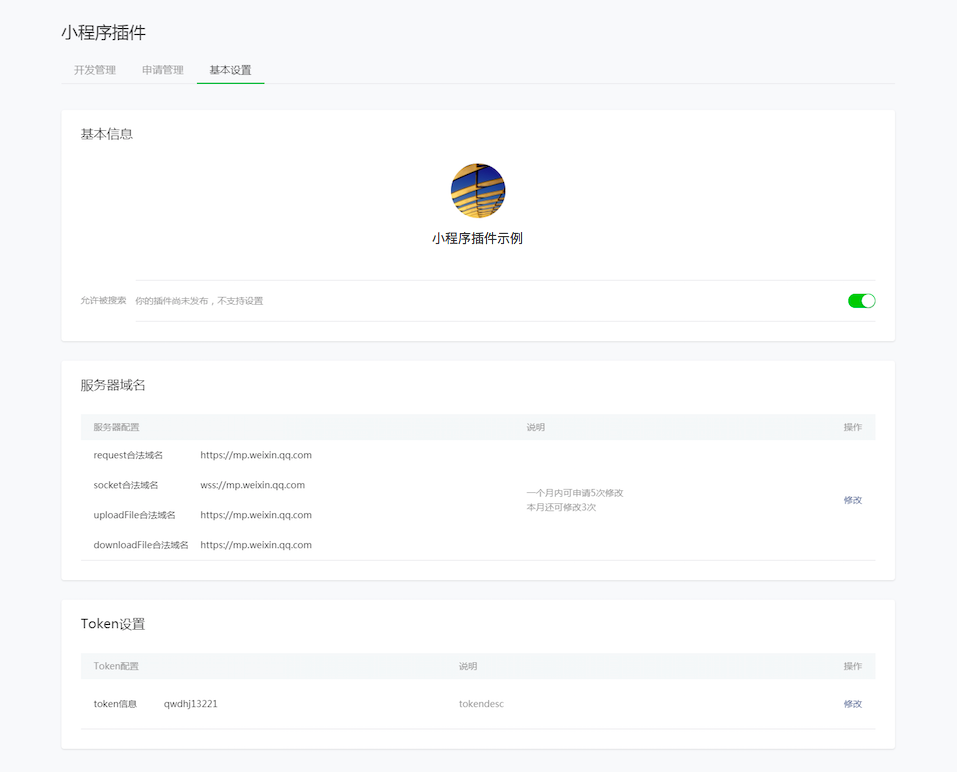

#### 完善基本信息

插件在提交审核前，请确认已设置插件名称、插件头像、插件简介等信息，并已上传插件开发文档，便于开发者接入插件。

##### 基本信息完善

登录小程序管理后台-小程序插件-基本设置，确认名称、头像、简介、添加方式、客服联系方式等信息都已完备。

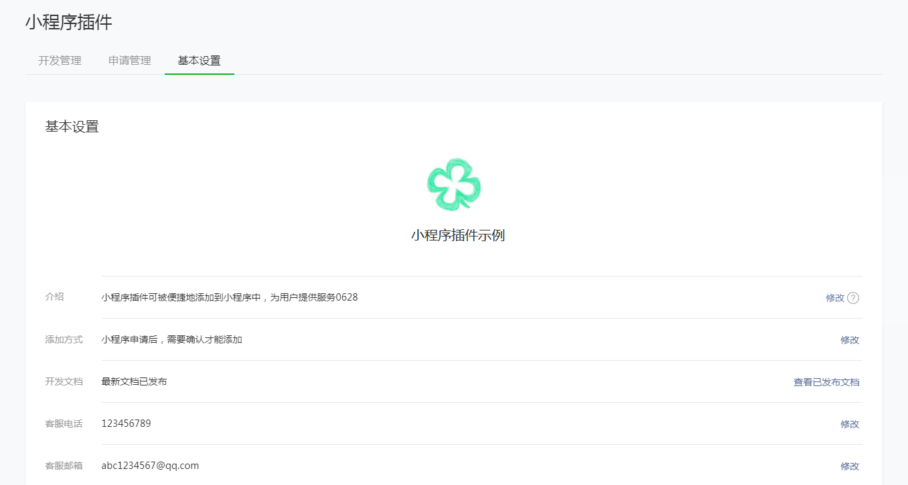

##### 插件开发文档编辑、上传

为便于小程序开发者快速接入插件服务，插件开发者可上传、发布插件开发文档，供接入方查看。

**（1）编辑**

除了插件代码本身，小程序开发者可以另外上传一份插件开发文档。这份文档必须放置在插件项目根目录中的 `doc` 目录下，目录结构如下：

```
doc
├── README.md   // 插件文档，应为 markdown 格式
└── picture.jpg // 其他资源文件，仅支持图片

```

其中，引用到的图片资源不能是网络图片，必须放在这个目录下。

**（2）上传**

编辑 `README.md` 之后，可以使用开发者工具预览插件文档和单独上传插件文档。

上传入口位置：README.md文档右下角

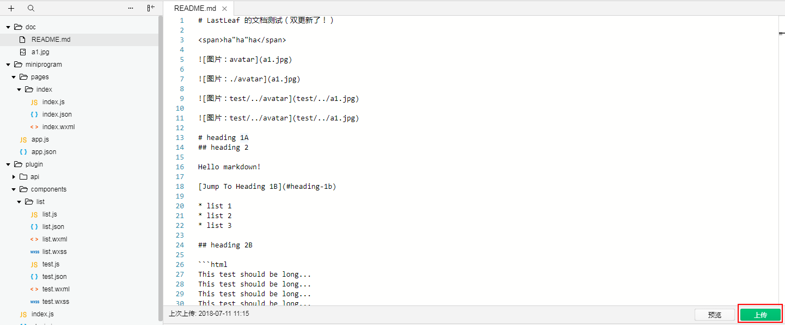

**（3）发布**

在开发者工具中上传文档之后，文档不会立刻发布。此时可以使用帐号和密码登录 [插件管理后台](https://mp.weixin.qq.com/) ，在 小程序插件 > 基本设置 中预览、发布插件文档。

文档发布后，可多次更新修改。

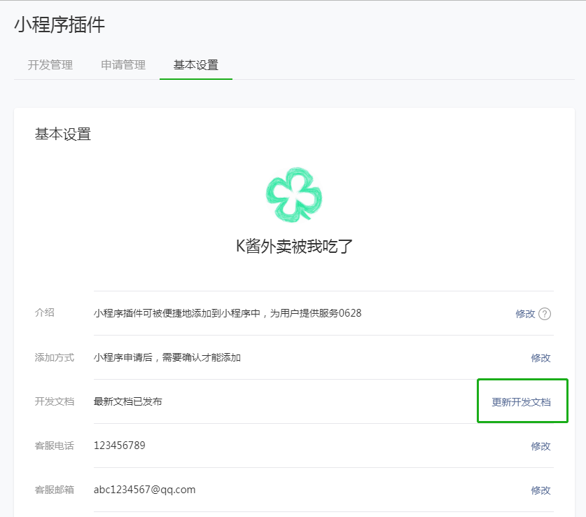

#### 插件版本管理

开发者可在开发者工具内上传代码并在小程序插件开发助手内完成插件的开发和调试。请注意：插件暂不支持在体验版中体验

在开发者工具上传代码后，开发者可”小程序管理后台-小程序插件-开发管理“内管理插件版本。

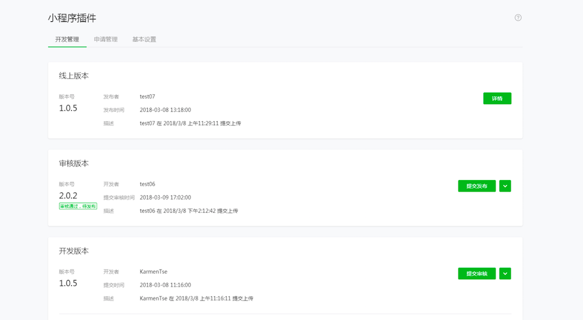

插件发布前需要提交微信小程序团队审核，审核通过后才可发布。

提交审核时，插件开发者需要填写以下信息：插件服务类目、标签、预览图及功能描述。

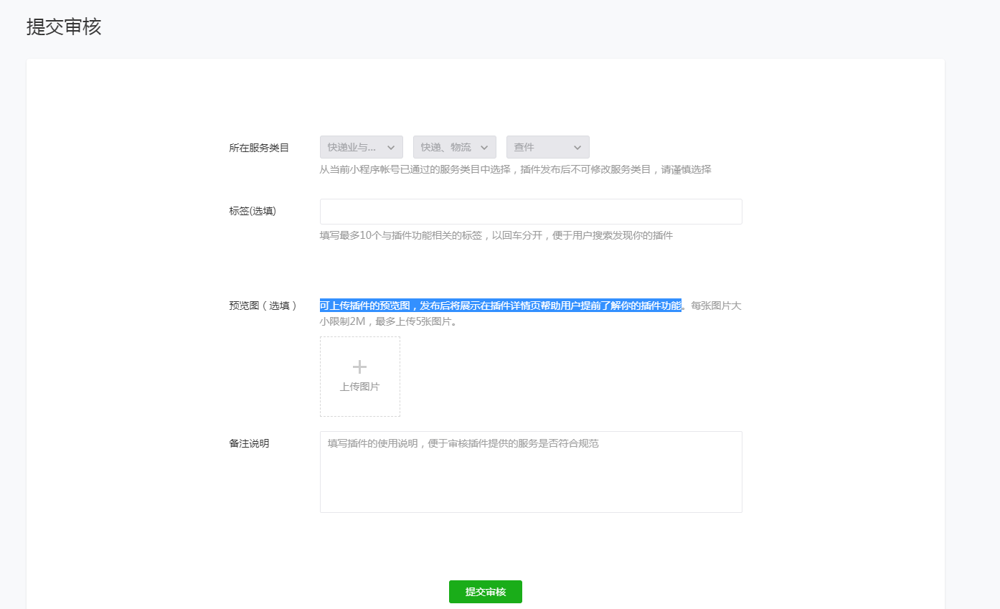

插件服务类目：插件可从当前小程序已通过的服务类目中选择一个。已开放类目表格见[插件开放范围及类目](#开放范围及服务类目)。

标签：请填写与插件提供的服务相关的标签。

预览图：可上传插件的预览图，发布后将展示在插件详情页帮助用户提前了解插件功能

功能描述：为便于审核团队体验及审核插件功能，请开发者填写基本介绍及插件的使用说明。

#### 使用申请管理

开发者可在”小程序管理后台-小程序插件-申请管理“内处理插件的接入申请。插件开发者可在24小时内选择”通过“或”拒绝“申请方使用插件。

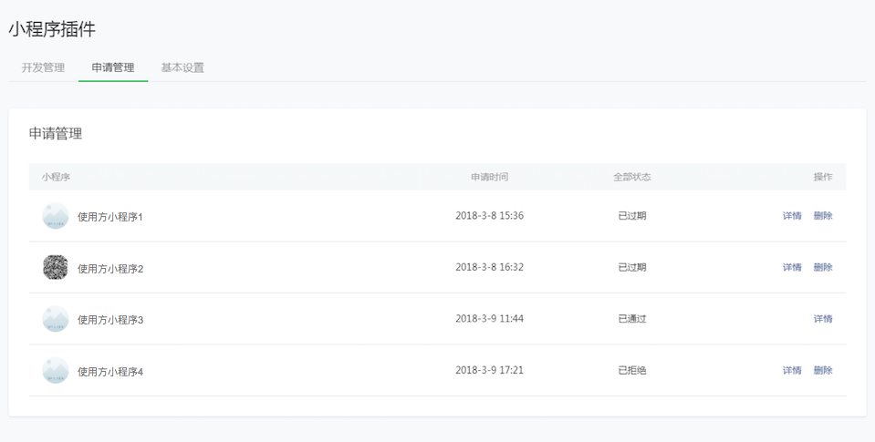

## 插件支付功能简介

插件内可使用支付能力，帮助插件开发者完成服务闭环。

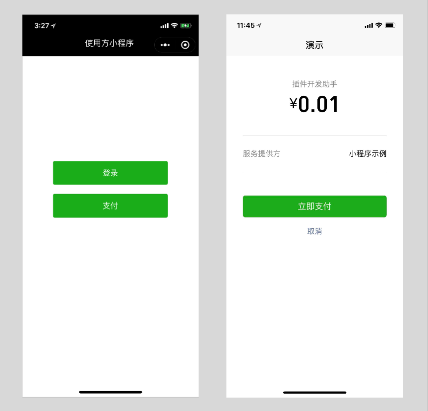

以下为接入流程

（1）插件所在小程序开通微信支付能力，查看[小程序开通微信支付指南](https://developers.weixin.qq.com/miniprogram/introduction/#小程序申请微信支付)

（2）根据使用场景，参照下表选择合适的支付模式

| 支付模式 | 适用范围                                     | 典型使用场景                                   | 接入流程                                     |
| ---- | ---------------------------------------- | ---------------------------------------- | ---------------------------------------- |
| 服务商  | 插件内涉及为入驻商家提供商品销售、代收款等服务，即销售的商品不是插件开发者提供的。 | 电商平台为入驻商户提供货架、购物车等服务；餐饮平台为线下入驻商户提供点餐、买单服务 | 1. 申请成为微信支付服务商，查看[《微信支付服务商功能介绍》](http://kf.qq.com/faq/161220euUvyE161220riaMrI.html)、[《微信支付服务商接入指引》](http://kf.qq.com/faq/161220iqeAfA1612202yeURB.html) <br/> 2. 为商户创建子商户号 <br/> 3. 绑定子商户号及插件所在的小程序帐号，查看[《开发文档》](https://pay.weixin.qq.com/wiki/doc/api/xiaowei.php?chapter=20_3&index=3) <br/> 4. 在插件内使用子商户号发起支付 |
| 普通商户 | 插件内付费服务/商品由插件开发者生产、销售                    |                                          | 在插件支付申请页面，必须提供已有线上服务信息（包括但不限于公众号、网站、APP、小程序等），并提供自营货品生产、销售等证明材料，如采购发票等。 |

（3）在插件管理后台提交插件支付能力申请，审核通过后将可在插件内使用微信支付能力

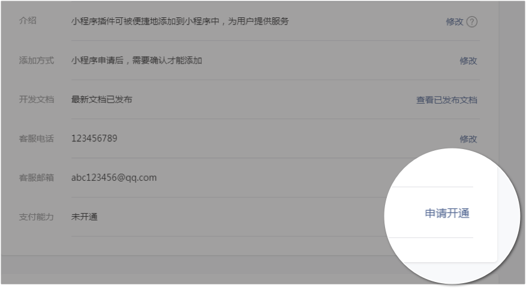

## 使用插件

小程序开发者可便捷地把插件添加到自己的小程序内，丰富小程序的服务。当用户在使用小程序时，将可以在小程序内使用插件提供的服务。

#### 开放范围

所有小程序

#### 接入流程

1. 在小程序管理后台添加插件

   小程序开发者可在“小程序管理后台-设置-第三方服务-插件管理”中查找需要的插件，并申请使用。插件开发者在24小时内通过后，小程序开发者可在小程序内使用该插件。

   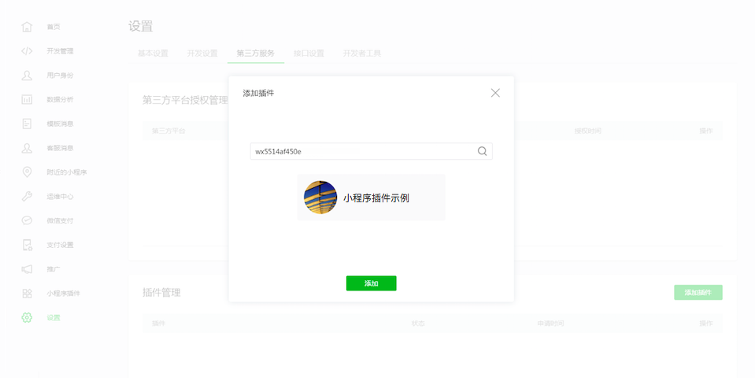

2. 在小程序代码中使用插件

   详见[《插件开发文档》](https://developers.weixin.qq.com/miniprogram/dev/framework/plugin/index.html)
