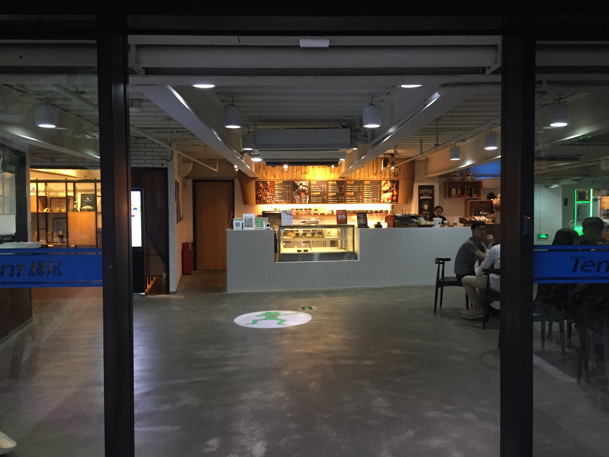

# 门店使用指南

为丰富小程序的服务能力，商户可在小程序后台绑定门店，用户可在微信内便捷地获取“附近的店”所属的小程序，并使用小程序提供的服务**（微信客户端“附近的店”入口暂未开放）**。

## 门店要求

小程序可绑定的门店必须满足以下条件：

1. 必须是线下可提供面对面服务的网点；
2. 具备经营资质，如营业执照或组织机构代码证等，且要求资质材料中的地址与门店地理位置一致，经营主体与小程序帐号主体一致；
3. 店内必须张贴或摆放该门店对应的小程序二维码宣传物料。

## 新增门店

登录小程序，进入“门店管理”，添加门店，一个小程序帐号可绑定不多于100个门店。

商户可选择手动添加门店，也可以直接从公众号导入已申请的门店。

### 全新添加

选择全新添加门店，并选定门店地理位置（若找不到门店，请先在[腾讯地图](http://ugc.map.qq.com/AppBox/Landlord/login.html)完成门店创建）后，填写上传包括服务类目、经营资质、门店内外景等材料，提交审核。门店审核将在七个工作日内完成。

### 从公众号导入

商户可从已有公众号导入门店地理信息，要求小程序帐号主体与公众号主体一致。**从公众号导入门店地理位置信息后，门店状态为“待补充”，需要返回门店管理页面补充提交门店相关审核材料。**

## 提交材料要求

新增门店需要填写并提交包括服务类目、经营资质、门店内外景图片等信息。

### 服务类目

门店服务类目对应小程序服务类目，商户完成小程序服务类目填写后，可选择小程序服务类目中的一个作为门店的服务类目。

### 经营资质

上传门店营业执照或组织机构代码证，营业执照/组织机构代码证地址信息必须与门店地理位置一致，门店主体必须与小程序主体一致。材料复印件加盖公司公章。

### 门店外景图

上传门店外景图，图片内必须包括**门店名称**及**外观信息**。示例如下：

### 门店内景图

上传门店内部图片，示例如下：

### 其他证明材料

**上传门店图片，图片内需包括店内张贴或摆放的小程序二维码宣传物料**，示例如下：

## 常见问题

**没有找到门店信息**

新增门店若在地图找不到对应的门店信息，或是在从公众号导入门店时显示门店已失效，商户需先在[腾讯地图](http://ugc.map.qq.com/AppBox/Landlord/login.html)登记门店信息，完成门店新建后再进行绑定。

**门店数量过多无法添加**

若该小程序帐号下绑定门店数已达上限，或公众号原有门店数量过多，请邮件联系微信公众平台（联系邮箱：weixinmp@qq.com）申请协助绑定。

**门店审核时长**

门店审核将在七个工作日内完成。

